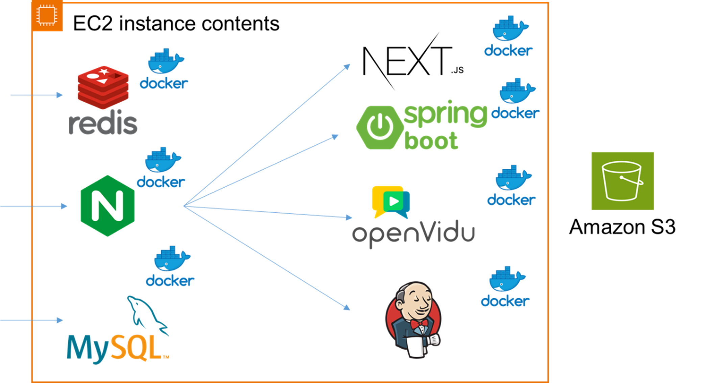

<div align="center">

</div>

# KoPlay🎮- 다문화 초등학생을 위한 한국어 교육 게이미피케이션 서비스

**SSAFY 11기 2학기 공통 프로젝트**


<details>
<summary>시연 영상 링크</summary>
<div markdown="0"  align="center">

[](https://youtu.be/0iKKYGFNOSM) 
</div>
</details>

>**개발기간: 24.07.08~24.08.16**

## 개발팀 소개

| 허지영 (FULL) | 구재승 (INFRA) | 권지인 (FRONT) |
| --- | --- | --- | 
| ||
| [@jiyoung-Heo](https://github.com/jiyoung-Heo) |  [@구재승]() | [@kjiin](https://github.com/kjiin) |

| 서지완 (BACK) | 석재륜 (FRONT) | 전성모 (FRONT) |
| --- | --- | --- |
| ||
| [@wannaseoji](https://github.com/wannaseoji) |  [@seokjr](https://github.com/seokjr) | [@SeongMorning](https://github.com/SeongMorning) |

## 기술 스택, 빌드 버전 및 기타 도구


### Frontend

   


### Backend

    


### Database


### Infra


### 기타 도구

 
 


### 버전
<details>
<summary>version</summary>
<div markdown="1">

```text
- next.js: 14.2.5
- Openvidu: 2.30.0
- Spring boot: 3.3.2
- MySQL: 8
- Redis: 7.4
- Nginx: 1.25.5
- AWS EC2 Ubuntu: 20.04.6 LTS
- Jenkins: 2.452.3
- Docker: 24.0.7
- Docker-compose: 1.25.0
- Node.js: 20.15.1(LTS)
- jdk: 17
- gradle: 8.8
- Visual Studio Code: 1.90.2
- IntelliJ IDEA: 2024.1.4
```
</div>
</details>

## 디렉토리 구조
<details>
<summary>front-end</summary>
<div markdown="1">

```text
📦front-end
 ┣ 📂koplaydev
 ┃ ┣ 📂.next
 ┃ ┣ 📂app
 ┃ ┃ ┣ 📂album
 ┃ ┃ ┃ ┣ 📂component
 ┃ ┃ ┃ ┃ ┗ 📂Embla
 ┃ ┃ ┃ ┃ ┃ ┣ 📜Embla.js
 ┃ ┃ ┃ ┃ ┃ ┣ 📜embla.scss
 ┃ ┃ ┃ ┃ ┃ ┣ 📜EmblaCarousel.js
 ┃ ┃ ┃ ┃ ┃ ┣ 📜EmblaCarouselArrowButtons.js
 ┃ ┃ ┃ ┃ ┃ ┗ 📜EmblaCarouselDotButton.js
 ┃ ┃ ┃ ┣ 📜page.js
 ┃ ┃ ┃ ┗ 📜page.module.scss
 ┃ ┃ ┣ 📂avatar
 ┃ ┃ ┃ ┣ 📂component
 ┃ ┃ ┃ ┃ ┣ 📜BlueBtn.js
 ┃ ┃ ┃ ┃ ┣ 📜BlueBtn.module.scss
 ┃ ┃ ┃ ┃ ┣ 📜BtnContainer.js
 ┃ ┃ ┃ ┃ ┣ 📜BtnContainer.module.scss
 ┃ ┃ ┃ ┃ ┣ 📜Cabinet.js
 ┃ ┃ ┃ ┃ ┣ 📜Cabinet.module.scss
 ┃ ┃ ┃ ┃ ┣ 📜Cam.js
 ┃ ┃ ┃ ┃ ┣ 📜Cam.module.scss
 ┃ ┃ ┃ ┃ ┣ 📜ChangeNation.js
 ┃ ┃ ┃ ┃ ┗ 📜ChangeNation.module.scss
 ┃ ┃ ┃ ┣ 📜page.js
 ┃ ┃ ┃ ┗ 📜page.module.scss
 ┃ ┃ ┣ 📂axios
 ┃ ┃ ┃ ┣ 📜albumAxios.js
 ┃ ┃ ┃ ┣ 📜allAvatarAxios.js
 ┃ ┃ ┃ ┣ 📜deleteChildAxios.js
 ┃ ┃ ┃ ┣ 📜fameAxios.js
 ┃ ┃ ┃ ┣ 📜gameListAxios.js
 ┃ ┃ ┃ ┣ 📜gameResultAxios.js
 ┃ ┃ ┃ ┣ 📜gameWordAxios.js
 ┃ ┃ ┃ ┣ 📜insertChildAxios.js
 ┃ ┃ ┃ ┣ 📜login.js
 ┃ ┃ ┃ ┣ 📜logoutAxios.js
 ┃ ┃ ┃ ┣ 📜modifyAvatarAxios.js
 ┃ ┃ ┃ ┣ 📜modifyParentNationAxios.js
 ┃ ┃ ┃ ┣ 📜modifyParentVisitAxios.js
 ┃ ┃ ┃ ┣ 📜modifyStudentInfoAxios.js
 ┃ ┃ ┃ ┣ 📜modifyStudentInfoImgAxios.js
 ┃ ┃ ┃ ┣ 📜myAvatarAxios.js
 ┃ ┃ ┃ ┣ 📜newAvatarAxios.js
 ┃ ┃ ┃ ┣ 📜parentChildAlbumAxios.js
 ┃ ┃ ┃ ┣ 📜parentChildInfoAxios.js
 ┃ ┃ ┃ ┣ 📜parentChildStatisticsAxios.js
 ┃ ┃ ┃ ┣ 📜parentInfoAxios.js
 ┃ ┃ ┃ ┣ 📜pictureAxios.js
 ┃ ┃ ┃ ┣ 📜studentGameCount.js
 ┃ ┃ ┃ ┣ 📜studentInfo.js
 ┃ ┃ ┃ ┣ 📜studentStatisticsAxios.js
 ┃ ┃ ┃ ┗ 📜translations.js
 ┃ ┃ ┣ 📂component
 ┃ ┃ ┃ ┣ 📂background
 ┃ ┃ ┃ ┃ ┣ 📜AlbumFameBg.js
 ┃ ┃ ┃ ┃ ┣ 📜AlbumFameBg.module.scss
 ┃ ┃ ┃ ┃ ┣ 📜GameBg.js
 ┃ ┃ ┃ ┃ ┣ 📜GameBg.module.scss
 ┃ ┃ ┃ ┃ ┣ 📜MainBg.js
 ┃ ┃ ┃ ┃ ┣ 📜MainBg.module.scss
 ┃ ┃ ┃ ┃ ┣ 📜MyPageBg.js
 ┃ ┃ ┃ ┃ ┣ 📜MyPageBg.module.scss
 ┃ ┃ ┃ ┃ ┣ 📜ParentBg.js
 ┃ ┃ ┃ ┃ ┣ 📜ParentBg.module.scss
 ┃ ┃ ┃ ┃ ┣ 📜PromLoginBg.js
 ┃ ┃ ┃ ┃ ┣ 📜PromLoginBg.module.scss
 ┃ ┃ ┃ ┃ ┣ 📜RankGameBg.js
 ┃ ┃ ┃ ┃ ┣ 📜RankGameBg.module.scss
 ┃ ┃ ┃ ┃ ┣ 📜StatisticBg.js
 ┃ ┃ ┃ ┃ ┗ 📜StatisticBg.module.scss
 ┃ ┃ ┃ ┣ 📂boxes
 ┃ ┃ ┃ ┃ ┣ 📜BlueBox.js
 ┃ ┃ ┃ ┃ ┣ 📜BlueBox.module.scss
 ┃ ┃ ┃ ┃ ┣ 📜BlurBox.js
 ┃ ┃ ┃ ┃ ┣ 📜BlurBox.module.scss
 ┃ ┃ ┃ ┃ ┣ 📜PinkBox.js
 ┃ ┃ ┃ ┃ ┣ 📜PinkBox.module.scss
 ┃ ┃ ┃ ┃ ┣ 📜WhiteBox.js
 ┃ ┃ ┃ ┃ ┣ 📜WhiteBox.module.scss
 ┃ ┃ ┃ ┃ ┣ 📜YellowBox.js
 ┃ ┃ ┃ ┃ ┗ 📜YellowBox.module.scss
 ┃ ┃ ┃ ┣ 📂buttons
 ┃ ┃ ┃ ┃ ┣ 📜BackScoreBtn.js
 ┃ ┃ ┃ ┃ ┗ 📜BackScoreBtn.module.scss
 ┃ ┃ ┃ ┣ 📜GoogleTranslate.js
 ┃ ┃ ┃ ┣ 📜Headers.js
 ┃ ┃ ┃ ┣ 📜Headers.module.scss
 ┃ ┃ ┃ ┣ 📜Star.js
 ┃ ┃ ┃ ┣ 📜Star.module.scss
 ┃ ┃ ┃ ┣ 📜StarBg.js
 ┃ ┃ ┃ ┣ 📜StarBg.module.scss
 ┃ ┃ ┃ ┣ 📜TalkBalloon.js
 ┃ ┃ ┃ ┗ 📜TalkBalloon.module.scss
 ┃ ┃ ┣ 📂fame
 ┃ ┃ ┃ ┣ 📂component
 ┃ ┃ ┃ ┃ ┣ 📜Podium.js
 ┃ ┃ ┃ ┃ ┗ 📜Podium.module.scss
 ┃ ┃ ┃ ┗ 📜page.js
 ┃ ┃ ┣ 📂game
 ┃ ┃ ┃ ┣ 📂component
 ┃ ┃ ┃ ┃ ┣ 📂flipflip
 ┃ ┃ ┃ ┃ ┃ ┣ 📜CardBack.js
 ┃ ┃ ┃ ┃ ┃ ┣ 📜CardBack.module.scss
 ┃ ┃ ┃ ┃ ┃ ┣ 📜CardFrontImage.js
 ┃ ┃ ┃ ┃ ┃ ┣ 📜CardFrontImage.module.scss
 ┃ ┃ ┃ ┃ ┃ ┣ 📜CardFrontText.js
 ┃ ┃ ┃ ┃ ┃ ┣ 📜CardFrontText.module.scss
 ┃ ┃ ┃ ┃ ┃ ┣ 📜FlipFlipGame.js
 ┃ ┃ ┃ ┃ ┃ ┣ 📜FlipFlipGameEnd.js
 ┃ ┃ ┃ ┃ ┃ ┣ 📜FlipFlipGameEnd.module.scss
 ┃ ┃ ┃ ┃ ┃ ┣ 📜FlipFlipGameJellyBtn.js
 ┃ ┃ ┃ ┃ ┃ ┣ 📜FlipFlipGameJellyBtn.module.scss
 ┃ ┃ ┃ ┃ ┃ ┣ 📜FlipFlipGameStart.js
 ┃ ┃ ┃ ┃ ┃ ┗ 📜FlipFlipGameStart.module.scss
 ┃ ┃ ┃ ┃ ┣ 📂games
 ┃ ┃ ┃ ┃ ┃ ┣ 📜FlipFlip.js
 ┃ ┃ ┃ ┃ ┃ ┣ 📜FlipFlip.module.scss
 ┃ ┃ ┃ ┃ ┃ ┣ 📜Smugogae.js
 ┃ ┃ ┃ ┃ ┃ ┣ 📜Smugogae.module.scss
 ┃ ┃ ┃ ┃ ┃ ┣ 📜WordRain.js
 ┃ ┃ ┃ ┃ ┃ ┗ 📜WordRain.module.scss
 ┃ ┃ ┃ ┃ ┣ 📂rankgame
 ┃ ┃ ┃ ┃ ┃ ┣ 📜rankTest.js
 ┃ ┃ ┃ ┃ ┃ ┣ 📜RankTest2.js
 ┃ ┃ ┃ ┃ ┃ ┗ 📜RankTest2.module.scss
 ┃ ┃ ┃ ┃ ┣ 📂smugogae
 ┃ ┃ ┃ ┃ ┃ ┣ 📜CardText.js
 ┃ ┃ ┃ ┃ ┃ ┣ 📜CardText.module.scss
 ┃ ┃ ┃ ┃ ┃ ┣ 📜Hint.js
 ┃ ┃ ┃ ┃ ┃ ┣ 📜Options.js
 ┃ ┃ ┃ ┃ ┃ ┣ 📜Options.module.scss
 ┃ ┃ ┃ ┃ ┃ ┣ 📜PlayJellyBtn.js
 ┃ ┃ ┃ ┃ ┃ ┣ 📜PlayJellyBtn.module.scss
 ┃ ┃ ┃ ┃ ┃ ┣ 📜SmuGame.js
 ┃ ┃ ┃ ┃ ┃ ┣ 📜SmuGame.module.scss
 ┃ ┃ ┃ ┃ ┃ ┣ 📜SmuGameEnd.js
 ┃ ┃ ┃ ┃ ┃ ┣ 📜SmuGameEnd.module.scss
 ┃ ┃ ┃ ┃ ┃ ┣ 📜SmuGameJellyBtn.js
 ┃ ┃ ┃ ┃ ┃ ┣ 📜SmuGameJellyBtn.module.scss
 ┃ ┃ ┃ ┃ ┃ ┣ 📜SmuGameStart.js
 ┃ ┃ ┃ ┃ ┃ ┣ 📜SmuGameStart.module.scss
 ┃ ┃ ┃ ┃ ┃ ┣ 📜SmuGameStartBtn.js
 ┃ ┃ ┃ ┃ ┃ ┗ 📜SmuGameStartBtn.module.scss
 ┃ ┃ ┃ ┃ ┣ 📜CardBack.js
 ┃ ┃ ┃ ┃ ┣ 📜CardBack.module.scss
 ┃ ┃ ┃ ┃ ┣ 📜CardFrontImage.js
 ┃ ┃ ┃ ┃ ┣ 📜CardFrontImage.module.scss
 ┃ ┃ ┃ ┃ ┣ 📜CardFrontText.js
 ┃ ┃ ┃ ┃ ┣ 📜CardFrontText.module.scss
 ┃ ┃ ┃ ┃ ┣ 📜GameJellyBtn.js
 ┃ ┃ ┃ ┃ ┣ 📜GameJellyBtn.module.scss
 ┃ ┃ ┃ ┃ ┣ 📜GameStartBtn.js
 ┃ ┃ ┃ ┃ ┣ 📜GameStartBtn.module.scss
 ┃ ┃ ┃ ┃ ┣ 📜RankGameJellyBtn.js
 ┃ ┃ ┃ ┃ ┣ 📜RankGameJellyBtn.module.scss
 ┃ ┃ ┃ ┃ ┣ 📜RankGameStartBtn.js
 ┃ ┃ ┃ ┃ ┣ 📜RankGameStartBtn.module.scss
 ┃ ┃ ┃ ┃ ┣ 📜RankWordRainGame.js
 ┃ ┃ ┃ ┃ ┣ 📜RewardJellyBtn.js
 ┃ ┃ ┃ ┃ ┣ 📜RewardJellyBtn.module.scss
 ┃ ┃ ┃ ┃ ┣ 📜TextToSpeech.js
 ┃ ┃ ┃ ┃ ┣ 📜WordRainEnd.js
 ┃ ┃ ┃ ┃ ┣ 📜WordRainEnd.module.scss
 ┃ ┃ ┃ ┃ ┣ 📜WordRainGame.js
 ┃ ┃ ┃ ┃ ┣ 📜WordRainStart.js
 ┃ ┃ ┃ ┃ ┗ 📜WordRainStart.module.scss
 ┃ ┃ ┃ ┣ 📂[id]
 ┃ ┃ ┃ ┃ ┣ 📜page.js
 ┃ ┃ ┃ ┃ ┗ 📜page.module.scss
 ┃ ┃ ┃ ┣ 📜loading.js
 ┃ ┃ ┃ ┗ 📜loading.module.scss
 ┃ ┃ ┣ 📂login
 ┃ ┃ ┃ ┣ 📂component
 ┃ ┃ ┃ ┃ ┣ 📜JellyBtn.js
 ┃ ┃ ┃ ┃ ┣ 📜JellyBtn.module.scss
 ┃ ┃ ┃ ┃ ┣ 📜LoginModalBtn.js
 ┃ ┃ ┃ ┃ ┣ 📜LoginModalBtn.module.scss
 ┃ ┃ ┃ ┃ ┣ 📜ParentLogin.js
 ┃ ┃ ┃ ┃ ┣ 📜ParentLogin.module.scss
 ┃ ┃ ┃ ┃ ┣ 📜ParentStudentBtn.js
 ┃ ┃ ┃ ┃ ┣ 📜ParentStudentBtn.module.scss
 ┃ ┃ ┃ ┃ ┣ 📜SelectStatus.js
 ┃ ┃ ┃ ┃ ┣ 📜StudentLogin.js
 ┃ ┃ ┃ ┃ ┗ 📜StudentLogin.module.scss
 ┃ ┃ ┃ ┣ 📜loading.js
 ┃ ┃ ┃ ┣ 📜loading.module.scss
 ┃ ┃ ┃ ┣ 📜page.js
 ┃ ┃ ┃ ┗ 📜page.module.scss
 ┃ ┃ ┣ 📂main
 ┃ ┃ ┃ ┣ 📂component
 ┃ ┃ ┃ ┃ ┣ 📂modals
 ┃ ┃ ┃ ┃ ┃ ┣ 📜FirstVisit.js
 ┃ ┃ ┃ ┃ ┃ ┣ 📜FirstVisit.module.scss
 ┃ ┃ ┃ ┃ ┃ ┣ 📜GameTutorial.js
 ┃ ┃ ┃ ┃ ┃ ┣ 📜GameTutorial.module.scss
 ┃ ┃ ┃ ┃ ┃ ┣ 📜NormalGame.js
 ┃ ┃ ┃ ┃ ┃ ┣ 📜NormalGame.module.scss
 ┃ ┃ ┃ ┃ ┃ ┣ 📜RankGame.js
 ┃ ┃ ┃ ┃ ┃ ┣ 📜RankGame.module.scss
 ┃ ┃ ┃ ┃ ┃ ┣ 📜Setting.js
 ┃ ┃ ┃ ┃ ┃ ┣ 📜Setting.module.scss
 ┃ ┃ ┃ ┃ ┃ ┣ 📜Test.js
 ┃ ┃ ┃ ┃ ┃ ┗ 📜Test.module.scss
 ┃ ┃ ┃ ┃ ┣ 📜DifficultyBtn.js
 ┃ ┃ ┃ ┃ ┣ 📜DifficultyBtn.module.scss
 ┃ ┃ ┃ ┃ ┣ 📜EasyBtn.js
 ┃ ┃ ┃ ┃ ┣ 📜EasyBtn.module.scss
 ┃ ┃ ┃ ┃ ┣ 📜ExpBar.js
 ┃ ┃ ┃ ┃ ┣ 📜ExpBar.module.scss
 ┃ ┃ ┃ ┃ ┣ 📜FameBtn.js
 ┃ ┃ ┃ ┃ ┣ 📜FameBtn.module.scss
 ┃ ┃ ┃ ┃ ┣ 📜GameJellyBtn.js
 ┃ ┃ ┃ ┃ ┣ 📜GameJellyBtn.module.scss
 ┃ ┃ ┃ ┃ ┣ 📜LevelJellyBtn.js
 ┃ ┃ ┃ ┃ ┣ 📜LevelJellyBtn.module.scss
 ┃ ┃ ┃ ┃ ┣ 📜LogoutModalBtn.js
 ┃ ┃ ┃ ┃ ┣ 📜LogoutModalBtn.module.scss
 ┃ ┃ ┃ ┃ ┣ 📜MainIcons.js
 ┃ ┃ ┃ ┃ ┣ 📜MainIcons.module.scss
 ┃ ┃ ┃ ┃ ┣ 📜MainMenu.js
 ┃ ┃ ┃ ┃ ┣ 📜MainMenu.mudule.scss
 ┃ ┃ ┃ ┃ ┣ 📜MainMenuBtn.js
 ┃ ┃ ┃ ┃ ┣ 📜MainMenuBtn.module.scss
 ┃ ┃ ┃ ┃ ┣ 📜MainModal.js
 ┃ ┃ ┃ ┃ ┣ 📜MainModal.module.scss
 ┃ ┃ ┃ ┃ ┣ 📜MicTest.js
 ┃ ┃ ┃ ┃ ┣ 📜Profile.js
 ┃ ┃ ┃ ┃ ┣ 📜Profile.module.scss
 ┃ ┃ ┃ ┃ ┣ 📜PwBlueBox.js
 ┃ ┃ ┃ ┃ ┣ 📜PwBlueBox.module.scss
 ┃ ┃ ┃ ┃ ┣ 📜PwPinkBox.js
 ┃ ┃ ┃ ┃ ┣ 📜PwPinkBox.module.scss
 ┃ ┃ ┃ ┃ ┣ 📜RankGameCancelBtn.js
 ┃ ┃ ┃ ┃ ┣ 📜RankGameCancelBtn.module.scss
 ┃ ┃ ┃ ┃ ┣ 📜WhiteTestBtn.js
 ┃ ┃ ┃ ┃ ┗ 📜WhiteTestBtn.module.scss
 ┃ ┃ ┃ ┗ 📜page.js
 ┃ ┃ ┣ 📂mypage
 ┃ ┃ ┃ ┣ 📂component
 ┃ ┃ ┃ ┃ ┣ 📜ClickedPinkBtn.js
 ┃ ┃ ┃ ┃ ┣ 📜ClickedPinkBtn.module.scss
 ┃ ┃ ┃ ┃ ┣ 📜Correct.js
 ┃ ┃ ┃ ┃ ┣ 📜Correct.module.scss
 ┃ ┃ ┃ ┃ ┣ 📜ExpBar.js
 ┃ ┃ ┃ ┃ ┣ 📜ExpBar.module.scss
 ┃ ┃ ┃ ┃ ┣ 📜MyPageInfo.js
 ┃ ┃ ┃ ┃ ┣ 📜MyPageInfo.module.scss
 ┃ ┃ ┃ ┃ ┣ 📜Score.js
 ┃ ┃ ┃ ┃ ┣ 📜Score.module.scss
 ┃ ┃ ┃ ┃ ┣ 📜YellowBox.js
 ┃ ┃ ┃ ┃ ┗ 📜YellowBox.module.scss
 ┃ ┃ ┃ ┗ 📜page.js
 ┃ ┃ ┣ 📂parent
 ┃ ┃ ┃ ┣ 📂child
 ┃ ┃ ┃ ┃ ┗ 📂[id]
 ┃ ┃ ┃ ┃ ┃ ┣ 📂component
 ┃ ┃ ┃ ┃ ┃ ┃ ┣ 📜CheckChildInfo.js
 ┃ ┃ ┃ ┃ ┃ ┃ ┣ 📜CheckChildInfo.module.scss
 ┃ ┃ ┃ ┃ ┃ ┃ ┣ 📜ClickedPinkBtn.js
 ┃ ┃ ┃ ┃ ┃ ┃ ┣ 📜ClickedPinkBtn.module.scss
 ┃ ┃ ┃ ┃ ┃ ┃ ┣ 📜CompleteBox.js
 ┃ ┃ ┃ ┃ ┃ ┃ ┣ 📜CompleteBox.module.scss
 ┃ ┃ ┃ ┃ ┃ ┃ ┣ 📜DetailBox.js
 ┃ ┃ ┃ ┃ ┃ ┃ ┣ 📜DetailBox.module.scss
 ┃ ┃ ┃ ┃ ┃ ┃ ┣ 📜DetailpageChildProfileCard.js
 ┃ ┃ ┃ ┃ ┃ ┃ ┣ 📜DetailpageChildProfileCard.module.scss
 ┃ ┃ ┃ ┃ ┃ ┃ ┣ 📜YellowBox.js
 ┃ ┃ ┃ ┃ ┃ ┃ ┗ 📜YellowBox.module.scss
 ┃ ┃ ┃ ┃ ┃ ┣ 📂statistic
 ┃ ┃ ┃ ┃ ┃ ┃ ┣ 📂component
 ┃ ┃ ┃ ┃ ┃ ┃ ┃ ┣ 📜Album.js
 ┃ ┃ ┃ ┃ ┃ ┃ ┃ ┣ 📜Album.module.scss
 ┃ ┃ ┃ ┃ ┃ ┃ ┃ ┣ 📜Correct.js
 ┃ ┃ ┃ ┃ ┃ ┃ ┃ ┣ 📜Correct.module.scss
 ┃ ┃ ┃ ┃ ┃ ┃ ┃ ┣ 📜CorrectAnswerRate.js
 ┃ ┃ ┃ ┃ ┃ ┃ ┃ ┣ 📜CorrectAnswerRate.module.scss
 ┃ ┃ ┃ ┃ ┃ ┃ ┃ ┣ 📜Progress.js
 ┃ ┃ ┃ ┃ ┃ ┃ ┃ ┗ 📜Progress.module.scss
 ┃ ┃ ┃ ┃ ┃ ┃ ┣ 📜Comparison.js
 ┃ ┃ ┃ ┃ ┃ ┃ ┣ 📜Comparison.module.scss
 ┃ ┃ ┃ ┃ ┃ ┃ ┣ 📜LevelJellyBtn.js
 ┃ ┃ ┃ ┃ ┃ ┃ ┣ 📜LevelJellyBtn.module.scss
 ┃ ┃ ┃ ┃ ┃ ┃ ┣ 📜page.js
 ┃ ┃ ┃ ┃ ┃ ┃ ┗ 📜page.module.scss
 ┃ ┃ ┃ ┃ ┃ ┣ 📜page.js
 ┃ ┃ ┃ ┃ ┃ ┗ 📜page.module.scss
 ┃ ┃ ┃ ┣ 📂component
 ┃ ┃ ┃ ┃ ┣ 📜AddProfileCard.js
 ┃ ┃ ┃ ┃ ┣ 📜AddProfileCard.module.scss
 ┃ ┃ ┃ ┃ ┣ 📜BackButton.js
 ┃ ┃ ┃ ┃ ┣ 📜BackButton.module.scss
 ┃ ┃ ┃ ┃ ┣ 📜carousel.js
 ┃ ┃ ┃ ┃ ┣ 📜carousel.module.scss
 ┃ ┃ ┃ ┃ ┣ 📜CheckChildInfo.js
 ┃ ┃ ┃ ┃ ┣ 📜CheckChildInfo.module.scss
 ┃ ┃ ┃ ┃ ┣ 📜ChildProfileCard.js
 ┃ ┃ ┃ ┃ ┣ 📜ChildProfileCard.module.scss
 ┃ ┃ ┃ ┃ ┣ 📜CompleteBox.js
 ┃ ┃ ┃ ┃ ┣ 📜CompleteBox.module.scss
 ┃ ┃ ┃ ┃ ┣ 📜DetailBox.js
 ┃ ┃ ┃ ┃ ┣ 📜DetailBox.module.scss
 ┃ ┃ ┃ ┃ ┣ 📜DetailpageChildProfileCard.js
 ┃ ┃ ┃ ┃ ┣ 📜DetailpageChildProfileCard.module.scss
 ┃ ┃ ┃ ┃ ┣ 📜DetailpageIndex.js
 ┃ ┃ ┃ ┃ ┣ 📜DetailpageIndex.module.scss
 ┃ ┃ ┃ ┃ ┣ 📜FirstVisitModal.js
 ┃ ┃ ┃ ┃ ┣ 📜FirstVisitModal.module.scss
 ┃ ┃ ┃ ┃ ┣ 📜InputChildInfo.js
 ┃ ┃ ┃ ┃ ┣ 📜InputChildInfo.module.scss
 ┃ ┃ ┃ ┃ ┣ 📜InputInitInfo.js
 ┃ ┃ ┃ ┃ ┣ 📜InputInitInfo.module.scss
 ┃ ┃ ┃ ┃ ┗ 📜style.js
 ┃ ┃ ┃ ┣ 📜page.js
 ┃ ┃ ┃ ┗ 📜page.module.scss
 ┃ ┃ ┣ 📂promotion
 ┃ ┃ ┃ ┣ 📂component
 ┃ ┃ ┃ ┃ ┣ 📜ButtonsContainer.js
 ┃ ┃ ┃ ┃ ┣ 📜ButtonsContainer.module.scss
 ┃ ┃ ┃ ┃ ┣ 📜DifficultyBtn.js
 ┃ ┃ ┃ ┃ ┣ 📜DifficultyBtn.module.scss
 ┃ ┃ ┃ ┃ ┣ 📜EasyBtn.js
 ┃ ┃ ┃ ┃ ┣ 📜EasyBtn.module.scss
 ┃ ┃ ┃ ┃ ┣ 📜GameJellyBtn.js
 ┃ ┃ ┃ ┃ ┣ 📜GameJellyBtn.module.scss
 ┃ ┃ ┃ ┃ ┣ 📜LevelJellyBtn.js
 ┃ ┃ ┃ ┃ ┣ 📜LevelJellyBtn.module.scss
 ┃ ┃ ┃ ┃ ┣ 📜MainModal.js
 ┃ ┃ ┃ ┃ ┣ 📜MainModal.module.scss
 ┃ ┃ ┃ ┃ ┣ 📜StartButton.js
 ┃ ┃ ┃ ┃ ┣ 📜StartButton.module.scss
 ┃ ┃ ┃ ┃ ┣ 📜Title.js
 ┃ ┃ ┃ ┃ ┗ 📜Title.module.scss
 ┃ ┃ ┃ ┣ 📂game
 ┃ ┃ ┃ ┃ ┣ 📂component
 ┃ ┃ ┃ ┃ ┃ ┣ 📂flipflip
 ┃ ┃ ┃ ┃ ┃ ┃ ┣ 📜CardBack.js
 ┃ ┃ ┃ ┃ ┃ ┃ ┣ 📜CardBack.module.scss
 ┃ ┃ ┃ ┃ ┃ ┃ ┣ 📜CardFrontImage.js
 ┃ ┃ ┃ ┃ ┃ ┃ ┣ 📜CardFrontImage.module.scss
 ┃ ┃ ┃ ┃ ┃ ┃ ┣ 📜CardFrontText.js
 ┃ ┃ ┃ ┃ ┃ ┃ ┣ 📜CardFrontText.module.scss
 ┃ ┃ ┃ ┃ ┃ ┃ ┣ 📜FlipFlipGame.js
 ┃ ┃ ┃ ┃ ┃ ┃ ┣ 📜FlipFlipGameEnd.js
 ┃ ┃ ┃ ┃ ┃ ┃ ┣ 📜FlipFlipGameEnd.module.scss
 ┃ ┃ ┃ ┃ ┃ ┃ ┣ 📜FlipFlipGameJellyBtn.js
 ┃ ┃ ┃ ┃ ┃ ┃ ┣ 📜FlipFlipGameJellyBtn.module.scss
 ┃ ┃ ┃ ┃ ┃ ┃ ┣ 📜FlipFlipGameStart.js
 ┃ ┃ ┃ ┃ ┃ ┃ ┗ 📜FlipFlipGameStart.module.scss
 ┃ ┃ ┃ ┃ ┃ ┣ 📂games
 ┃ ┃ ┃ ┃ ┃ ┃ ┣ 📜FlipFlip.js
 ┃ ┃ ┃ ┃ ┃ ┃ ┣ 📜FlipFlip.module.scss
 ┃ ┃ ┃ ┃ ┃ ┃ ┣ 📜Smugogae.js
 ┃ ┃ ┃ ┃ ┃ ┃ ┣ 📜Smugogae.module.scss
 ┃ ┃ ┃ ┃ ┃ ┃ ┣ 📜WordRain.js
 ┃ ┃ ┃ ┃ ┃ ┃ ┗ 📜WordRain.module.scss
 ┃ ┃ ┃ ┃ ┃ ┣ 📂smugogae
 ┃ ┃ ┃ ┃ ┃ ┃ ┣ 📜CardText.js
 ┃ ┃ ┃ ┃ ┃ ┃ ┣ 📜CardText.module.scss
 ┃ ┃ ┃ ┃ ┃ ┃ ┣ 📜Hint.js
 ┃ ┃ ┃ ┃ ┃ ┃ ┣ 📜Options.js
 ┃ ┃ ┃ ┃ ┃ ┃ ┣ 📜Options.module.scss
 ┃ ┃ ┃ ┃ ┃ ┃ ┣ 📜PlayJellyBtn.js
 ┃ ┃ ┃ ┃ ┃ ┃ ┣ 📜PlayJellyBtn.module.scss
 ┃ ┃ ┃ ┃ ┃ ┃ ┣ 📜SmuGame.js
 ┃ ┃ ┃ ┃ ┃ ┃ ┣ 📜SmuGame.module.scss
 ┃ ┃ ┃ ┃ ┃ ┃ ┣ 📜SmuGameEnd.js
 ┃ ┃ ┃ ┃ ┃ ┃ ┣ 📜SmuGameEnd.module.scss
 ┃ ┃ ┃ ┃ ┃ ┃ ┣ 📜SmuGameJellyBtn.js
 ┃ ┃ ┃ ┃ ┃ ┃ ┣ 📜SmuGameJellyBtn.module.scss
 ┃ ┃ ┃ ┃ ┃ ┃ ┣ 📜SmuGameStart.js
 ┃ ┃ ┃ ┃ ┃ ┃ ┣ 📜SmuGameStart.module.scss
 ┃ ┃ ┃ ┃ ┃ ┃ ┣ 📜SmuGameStartBtn.js
 ┃ ┃ ┃ ┃ ┃ ┃ ┗ 📜SmuGameStartBtn.module.scss
 ┃ ┃ ┃ ┃ ┃ ┣ 📜CardBack.js
 ┃ ┃ ┃ ┃ ┃ ┣ 📜CardBack.module.scss
 ┃ ┃ ┃ ┃ ┃ ┣ 📜CardFrontImage.js
 ┃ ┃ ┃ ┃ ┃ ┣ 📜CardFrontImage.module.scss
 ┃ ┃ ┃ ┃ ┃ ┣ 📜CardFrontText.js
 ┃ ┃ ┃ ┃ ┃ ┣ 📜CardFrontText.module.scss
 ┃ ┃ ┃ ┃ ┃ ┣ 📜GameJellyBtn.js
 ┃ ┃ ┃ ┃ ┃ ┣ 📜GameJellyBtn.module.scss
 ┃ ┃ ┃ ┃ ┃ ┣ 📜GameStartBtn.js
 ┃ ┃ ┃ ┃ ┃ ┣ 📜GameStartBtn.module.scss
 ┃ ┃ ┃ ┃ ┃ ┣ 📜RankGameStartBtn.js
 ┃ ┃ ┃ ┃ ┃ ┣ 📜RankGameStartBtn.module.scss
 ┃ ┃ ┃ ┃ ┃ ┣ 📜RankWordRainGame.js
 ┃ ┃ ┃ ┃ ┃ ┣ 📜RewardJellyBtn.js
 ┃ ┃ ┃ ┃ ┃ ┣ 📜RewardJellyBtn.module.scss
 ┃ ┃ ┃ ┃ ┃ ┣ 📜TextToSpeech.js
 ┃ ┃ ┃ ┃ ┃ ┣ 📜WordRainEnd.js
 ┃ ┃ ┃ ┃ ┃ ┣ 📜WordRainEnd.module.scss
 ┃ ┃ ┃ ┃ ┃ ┣ 📜WordRainGame.js
 ┃ ┃ ┃ ┃ ┃ ┣ 📜WordRainStart.js
 ┃ ┃ ┃ ┃ ┃ ┗ 📜WordRainStart.module.scss
 ┃ ┃ ┃ ┃ ┣ 📂[id]
 ┃ ┃ ┃ ┃ ┃ ┣ 📜page.js
 ┃ ┃ ┃ ┃ ┃ ┗ 📜page.module.scss
 ┃ ┃ ┃ ┃ ┣ 📜loading.js
 ┃ ┃ ┃ ┃ ┗ 📜loading.module.scss
 ┃ ┃ ┃ ┗ 📂modal
 ┃ ┃ ┃ ┃ ┣ 📜NonLoginGame.js
 ┃ ┃ ┃ ┃ ┗ 📜NonLoginGame.module.scss
 ┃ ┃ ┣ 📂tutorial
 ┃ ┃ ┃ ┗ 📂[nation]
 ┃ ┃ ┃ ┃ ┗ 📂[id]
 ┃ ┃ ┃ ┃ ┃ ┣ 📂component
 ┃ ┃ ┃ ┃ ┃ ┃ ┣ 📂china
 ┃ ┃ ┃ ┃ ┃ ┃ ┃ ┣ 📜FlipC.js
 ┃ ┃ ┃ ┃ ┃ ┃ ┃ ┣ 📜RainC.js
 ┃ ┃ ┃ ┃ ┃ ┃ ┃ ┗ 📜SmuC.js
 ┃ ┃ ┃ ┃ ┃ ┃ ┣ 📂korea
 ┃ ┃ ┃ ┃ ┃ ┃ ┃ ┣ 📜FlipK.js
 ┃ ┃ ┃ ┃ ┃ ┃ ┃ ┣ 📜RainK.js
 ┃ ┃ ┃ ┃ ┃ ┃ ┃ ┗ 📜SmuK.js
 ┃ ┃ ┃ ┃ ┃ ┃ ┣ 📂thailand
 ┃ ┃ ┃ ┃ ┃ ┃ ┃ ┣ 📜FlipT.js
 ┃ ┃ ┃ ┃ ┃ ┃ ┃ ┣ 📜RainT.js
 ┃ ┃ ┃ ┃ ┃ ┃ ┃ ┗ 📜SmuT.js
 ┃ ┃ ┃ ┃ ┃ ┃ ┣ 📂vietnam
 ┃ ┃ ┃ ┃ ┃ ┃ ┃ ┣ 📜FlipV.js
 ┃ ┃ ┃ ┃ ┃ ┃ ┃ ┣ 📜RainV.js
 ┃ ┃ ┃ ┃ ┃ ┃ ┃ ┗ 📜SmuV.js
 ┃ ┃ ┃ ┃ ┃ ┃ ┗ 📜Tutorial.module.scss
 ┃ ┃ ┃ ┃ ┃ ┗ 📜page.js
 ┃ ┃ ┣ 📂utils
 ┃ ┃ ┃ ┣ 📂AR
 ┃ ┃ ┃ ┃ ┣ 📜app.js
 ┃ ┃ ┃ ┃ ┣ 📜FacePaint.js
 ┃ ┃ ┃ ┃ ┣ 📜frontProjectionUVMap.js
 ┃ ┃ ┃ ┃ ┣ 📜jamini-mask.jpg
 ┃ ┃ ┃ ┃ ┣ 📜positionBufferData.js
 ┃ ┃ ┃ ┃ ┣ 📜script.js
 ┃ ┃ ┃ ┃ ┣ 📜triangulation.js
 ┃ ┃ ┃ ┃ ┗ 📜useFaceMask.js
 ┃ ┃ ┃ ┣ 📂openvidu
 ┃ ┃ ┃ ┃ ┣ 📜OpenVidu.js
 ┃ ┃ ┃ ┃ ┣ 📜OpenVidu.module.scss
 ┃ ┃ ┃ ┃ ┣ 📜OpenViduVideo.js
 ┃ ┃ ┃ ┃ ┣ 📜OpenViduVideo.module.scss
 ┃ ┃ ┃ ┃ ┣ 📜sessionCheckAndDelete.js
 ┃ ┃ ┃ ┃ ┣ 📜UserVideo.js
 ┃ ┃ ┃ ┃ ┣ 📜UserVideo.module.scss
 ┃ ┃ ┃ ┃ ┗ 📜useStream.js
 ┃ ┃ ┃ ┣ 📜API.js
 ┃ ┃ ┃ ┣ 📜effectSound.js
 ┃ ┃ ┃ ┣ 📜globalSound.js
 ┃ ┃ ┃ ┣ 📜OpenAiStreamUtill.js
 ┃ ┃ ┃ ┣ 📜OpenAiUtill.js
 ┃ ┃ ┃ ┣ 📜useEffectSound.js
 ┃ ┃ ┃ ┣ 📜useSound.js
 ┃ ┃ ┃ ┣ 📜useSpeechToText.js
 ┃ ┃ ┃ ┗ 📜websockectManager.js
 ┃ ┃ ┣ 📂websocket
 ┃ ┃ ┃ ┗ 📜page.js
 ┃ ┃ ┣ 📜favicon.ico
 ┃ ┃ ┣ 📜globals.scss
 ┃ ┃ ┣ 📜hehe.png
 ┃ ┃ ┣ 📜hehe192.png
 ┃ ┃ ┣ 📜hehe384.png
 ┃ ┃ ┣ 📜layout.js
 ┃ ┃ ┣ 📜loading.js
 ┃ ┃ ┣ 📜loading.module.scss
 ┃ ┃ ┣ 📜manifest.json
 ┃ ┃ ┣ 📜maskable_icon_x192.png
 ┃ ┃ ┣ 📜maskable_icon_x384.png
 ┃ ┃ ┣ 📜maskable_icon_x512.png
 ┃ ┃ ┣ 📜page.js
 ┃ ┃ ┗ 📜page.module.scss
 ┃ ┣ 📂node_modules
 ┃ ┣ 📂pages
 ┃ ┣ 📂public
 ┃ ┃ ┣ 📂cursors
 ┃ ┃ ┣ 📂icons
 ┃ ┃ ┃ ┗ 📂manifest
 ┃ ┣ 📂redux
 ┃ ┃ ┣ 📂slices
 ┃ ┃ ┃ ┣ 📜avatarSlice.js
 ┃ ┃ ┃ ┣ 📜correct.js
 ┃ ┃ ┃ ┣ 📜currentAvatar.js
 ┃ ┃ ┃ ┣ 📜currNationSlice.js
 ┃ ┃ ┃ ┣ 📜expSlice.js
 ┃ ┃ ┃ ┣ 📜gameLeftSlice.js
 ┃ ┃ ┃ ┣ 📜gamePurposeSlice.js
 ┃ ┃ ┃ ┣ 📜gameSlice.js
 ┃ ┃ ┃ ┣ 📜gameWordSlice.js
 ┃ ┃ ┃ ┣ 📜graphLevel.js
 ┃ ┃ ┃ ┣ 📜hintsSlice.js
 ┃ ┃ ┃ ┣ 📜Incorrect.js
 ┃ ┃ ┃ ┣ 📜isRankSlice.js
 ┃ ┃ ┃ ┣ 📜levelSlice.js
 ┃ ┃ ┃ ┣ 📜loadingSlice.js
 ┃ ┃ ┃ ┣ 📜modalSlice.js
 ┃ ┃ ┃ ┣ 📜myPageSlice.js
 ┃ ┃ ┃ ┣ 📜parentChaildsSlice.js
 ┃ ┃ ┃ ┣ 📜parentChaildStatisticSlice.js
 ┃ ┃ ┃ ┣ 📜parentSlice.js
 ┃ ┃ ┃ ┣ 📜roomIdSlice.js
 ┃ ┃ ┃ ┣ 📜studentAvatarSlice.js
 ┃ ┃ ┃ ┣ 📜studentInfoSlice.js
 ┃ ┃ ┃ ┣ 📜testSlice.js
 ┃ ┃ ┃ ┣ 📜tokenSlice.js
 ┃ ┃ ┃ ┣ 📜translationWords.js
 ┃ ┃ ┃ ┣ 📜webSocketSlice.js
 ┃ ┃ ┃ ┣ 📜WordRainSlice.js
 ┃ ┃ ┃ ┗ 📜wrongList.js
 ┃ ┃ ┣ 📜provider.js
 ┃ ┃ ┣ 📜reduxStore.js
 ┃ ┃ ┗ 📜store.js
 ┃ ┣ 📜.gitignore
 ┃ ┣ 📜docker-compose.override.yml
 ┃ ┣ 📜docker-compose.yml
 ┃ ┣ 📜Dockerfile
 ┃ ┣ 📜jsconfig.json
 ┃ ┣ 📜next.config.mjs
 ┃ ┣ 📜package-lock.json
 ┃ ┣ 📜package.json
 ┃ ┣ 📜README.md
 ┃ ┗ 📜socket.js
 ┗ 📜temp.temp
```
</div>
</details>
<details>
<summary>back-end</summary>
<div markdown="2">

```text
📦back-end
 ┗ 📂koplaydev
 ┃ ┣ 📂.gradle
 ┃ ┣ 📂build
 ┃ ┃ ┣ 📂classes
 ┃ ┃ ┃ ┗ 📂java
 ┃ ┃ ┃ ┃ ┗ 📂main
 ┃ ┃ ┃ ┃ ┃ ┗ 📂com
 ┃ ┃ ┃ ┃ ┃ ┃ ┗ 📂edu
 ┃ ┃ ┃ ┃ ┃ ┃ ┃ ┗ 📂koplay
 ┃ ┃ ┃ ┃ ┃ ┃ ┃ ┃ ┣ 📂batch
 ┃ ┃ ┃ ┃ ┃ ┃ ┃ ┃ ┃ ┣ 📂config
 ┃ ┃ ┃ ┃ ┃ ┃ ┃ ┃ ┃ ┃ ┗ 📜BatchConfig.class
 ┃ ┃ ┃ ┃ ┃ ┃ ┃ ┃ ┃ ┣ 📂scheduler
 ┃ ┃ ┃ ┃ ┃ ┃ ┃ ┃ ┃ ┃ ┗ 📜ScheduledBatchRunner.class
 ┃ ┃ ┃ ┃ ┃ ┃ ┃ ┃ ┃ ┣ 📜CustomItemProcessor.class
 ┃ ┃ ┃ ┃ ┃ ┃ ┃ ┃ ┃ ┣ 📜CustomItemReader.class
 ┃ ┃ ┃ ┃ ┃ ┃ ┃ ┃ ┃ ┣ 📜CustomItemWriter.class
 ┃ ┃ ┃ ┃ ┃ ┃ ┃ ┃ ┃ ┗ 📜Top3Players.class
 ┃ ┃ ┃ ┃ ┃ ┃ ┃ ┃ ┣ 📂config
 ┃ ┃ ┃ ┃ ┃ ┃ ┃ ┃ ┃ ┣ 📜LocaleConfig.class
 ┃ ┃ ┃ ┃ ┃ ┃ ┃ ┃ ┃ ┣ 📜S3Config.class
 ┃ ┃ ┃ ┃ ┃ ┃ ┃ ┃ ┃ ┣ 📜ServerConfig.class
 ┃ ┃ ┃ ┃ ┃ ┃ ┃ ┃ ┃ ┗ 📜SwaggerConfig.class
 ┃ ┃ ┃ ┃ ┃ ┃ ┃ ┃ ┣ 📂controller
 ┃ ┃ ┃ ┃ ┃ ┃ ┃ ┃ ┃ ┣ 📂AvatarController
 ┃ ┃ ┃ ┃ ┃ ┃ ┃ ┃ ┃ ┃ ┗ 📜AvatarController.class
 ┃ ┃ ┃ ┃ ┃ ┃ ┃ ┃ ┃ ┣ 📂game
 ┃ ┃ ┃ ┃ ┃ ┃ ┃ ┃ ┃ ┃ ┗ 📜GameController.class
 ┃ ┃ ┃ ┃ ┃ ┃ ┃ ┃ ┃ ┣ 📂global
 ┃ ┃ ┃ ┃ ┃ ┃ ┃ ┃ ┃ ┃ ┗ 📜GlobalController.class
 ┃ ┃ ┃ ┃ ┃ ┃ ┃ ┃ ┃ ┣ 📂parent
 ┃ ┃ ┃ ┃ ┃ ┃ ┃ ┃ ┃ ┃ ┗ 📜ParentController.class
 ┃ ┃ ┃ ┃ ┃ ┃ ┃ ┃ ┃ ┣ 📂s3
 ┃ ┃ ┃ ┃ ┃ ┃ ┃ ┃ ┃ ┃ ┗ 📜S3Controller.class
 ┃ ┃ ┃ ┃ ┃ ┃ ┃ ┃ ┃ ┣ 📂student
 ┃ ┃ ┃ ┃ ┃ ┃ ┃ ┃ ┃ ┃ ┗ 📜StudentController.class
 ┃ ┃ ┃ ┃ ┃ ┃ ┃ ┃ ┃ ┣ 📜AuthController.class
 ┃ ┃ ┃ ┃ ┃ ┃ ┃ ┃ ┃ ┗ 📜MainController.class
 ┃ ┃ ┃ ┃ ┃ ┃ ┃ ┃ ┣ 📂dto
 ┃ ┃ ┃ ┃ ┃ ┃ ┃ ┃ ┃ ┣ 📜AllAveragePerPurposeDTO.class
 ┃ ┃ ┃ ┃ ┃ ┃ ┃ ┃ ┃ ┣ 📜AvatarDTO.class
 ┃ ┃ ┃ ┃ ┃ ┃ ┃ ┃ ┃ ┣ 📜ChangeAvatarDTO.class
 ┃ ┃ ┃ ┃ ┃ ┃ ┃ ┃ ┃ ┣ 📜DailySpecificDTO.class
 ┃ ┃ ┃ ┃ ┃ ┃ ┃ ┃ ┃ ┣ 📜ExpDTO.class
 ┃ ┃ ┃ ┃ ┃ ┃ ┃ ┃ ┃ ┣ 📜GalleryDTO.class
 ┃ ┃ ┃ ┃ ┃ ┃ ┃ ┃ ┃ ┣ 📜GameCorrectDTO.class
 ┃ ┃ ┃ ┃ ┃ ┃ ┃ ┃ ┃ ┣ 📜GameCountPerPurposeDTO.class
 ┃ ┃ ┃ ┃ ┃ ┃ ┃ ┃ ┃ ┣ 📜GameDataDTO$GameDataDTOBuilder.class
 ┃ ┃ ┃ ┃ ┃ ┃ ┃ ┃ ┃ ┣ 📜GameDataDTO.class
 ┃ ┃ ┃ ┃ ┃ ┃ ┃ ┃ ┃ ┣ 📜GameDTO$GameDTOBuilder.class
 ┃ ┃ ┃ ┃ ┃ ┃ ┃ ┃ ┃ ┣ 📜GameDTO.class
 ┃ ┃ ┃ ┃ ┃ ┃ ┃ ┃ ┃ ┣ 📜GameResultDTO$GameResultDTOBuilder.class
 ┃ ┃ ┃ ┃ ┃ ┃ ┃ ┃ ┃ ┣ 📜GameResultDTO.class
 ┃ ┃ ┃ ┃ ┃ ┃ ┃ ┃ ┃ ┣ 📜ParentDTO.class
 ┃ ┃ ┃ ┃ ┃ ┃ ┃ ┃ ┃ ┣ 📜PollDTO$PollDTOBuilder.class
 ┃ ┃ ┃ ┃ ┃ ┃ ┃ ┃ ┃ ┣ 📜PollDTO.class
 ┃ ┃ ┃ ┃ ┃ ┃ ┃ ┃ ┃ ┣ 📜ResponseDTO$ResponseDTOBuilder.class
 ┃ ┃ ┃ ┃ ┃ ┃ ┃ ┃ ┃ ┣ 📜ResponseDTO.class
 ┃ ┃ ┃ ┃ ┃ ┃ ┃ ┃ ┃ ┣ 📜StudentDTO$StudentDTOBuilder.class
 ┃ ┃ ┃ ┃ ┃ ┃ ┃ ┃ ┃ ┣ 📜StudentDTO.class
 ┃ ┃ ┃ ┃ ┃ ┃ ┃ ┃ ┃ ┣ 📜StudentLevelDTO$StudentLevelDTOBuilder.class
 ┃ ┃ ┃ ┃ ┃ ┃ ┃ ┃ ┃ ┣ 📜StudentLevelDTO.class
 ┃ ┃ ┃ ┃ ┃ ┃ ┃ ┃ ┃ ┣ 📜StudentMypageDTO$StudentMypageDTOBuilder.class
 ┃ ┃ ┃ ┃ ┃ ┃ ┃ ┃ ┃ ┣ 📜StudentMypageDTO.class
 ┃ ┃ ┃ ┃ ┃ ┃ ┃ ┃ ┃ ┣ 📜StudentUsableAvatarDTO.class
 ┃ ┃ ┃ ┃ ┃ ┃ ┃ ┃ ┃ ┣ 📜WordDTO.class
 ┃ ┃ ┃ ┃ ┃ ┃ ┃ ┃ ┃ ┣ 📜WordGameDataDTO.class
 ┃ ┃ ┃ ┃ ┃ ┃ ┃ ┃ ┃ ┗ 📜WordRequestDTO.class
 ┃ ┃ ┃ ┃ ┃ ┃ ┃ ┃ ┣ 📂model
 ┃ ┃ ┃ ┃ ┃ ┃ ┃ ┃ ┃ ┣ 📜Avatar$AvatarBuilder.class
 ┃ ┃ ┃ ┃ ┃ ┃ ┃ ┃ ┃ ┣ 📜Avatar.class
 ┃ ┃ ┃ ┃ ┃ ┃ ┃ ┃ ┃ ┣ 📜Gallery$GalleryBuilder.class
 ┃ ┃ ┃ ┃ ┃ ┃ ┃ ┃ ┃ ┣ 📜Gallery.class
 ┃ ┃ ┃ ┃ ┃ ┃ ┃ ┃ ┃ ┣ 📜Game$GameBuilder.class
 ┃ ┃ ┃ ┃ ┃ ┃ ┃ ┃ ┃ ┣ 📜Game.class
 ┃ ┃ ┃ ┃ ┃ ┃ ┃ ┃ ┃ ┣ 📜GameData$GameDataBuilder.class
 ┃ ┃ ┃ ┃ ┃ ┃ ┃ ┃ ┃ ┣ 📜GameData.class
 ┃ ┃ ┃ ┃ ┃ ┃ ┃ ┃ ┃ ┣ 📜GamePurpose$GamePurposeBuilder.class
 ┃ ┃ ┃ ┃ ┃ ┃ ┃ ┃ ┃ ┣ 📜GamePurpose.class
 ┃ ┃ ┃ ┃ ┃ ┃ ┃ ┃ ┃ ┣ 📜Music$MusicBuilder.class
 ┃ ┃ ┃ ┃ ┃ ┃ ┃ ┃ ┃ ┣ 📜Music.class
 ┃ ┃ ┃ ┃ ┃ ┃ ┃ ┃ ┃ ┣ 📜Nation$NationBuilder.class
 ┃ ┃ ┃ ┃ ┃ ┃ ┃ ┃ ┃ ┣ 📜Nation.class
 ┃ ┃ ┃ ┃ ┃ ┃ ┃ ┃ ┃ ┣ 📜Parent$ParentBuilder.class
 ┃ ┃ ┃ ┃ ┃ ┃ ┃ ┃ ┃ ┣ 📜Parent.class
 ┃ ┃ ┃ ┃ ┃ ┃ ┃ ┃ ┃ ┣ 📜RecommendLevel$RecommendLevelBuilder.class
 ┃ ┃ ┃ ┃ ┃ ┃ ┃ ┃ ┃ ┣ 📜RecommendLevel.class
 ┃ ┃ ┃ ┃ ┃ ┃ ┃ ┃ ┃ ┣ 📜Student$StudentBuilder.class
 ┃ ┃ ┃ ┃ ┃ ┃ ┃ ┃ ┃ ┣ 📜Student.class
 ┃ ┃ ┃ ┃ ┃ ┃ ┃ ┃ ┃ ┣ 📜StudentUsableAvatar$StudentUsableAvatarBuilder.class
 ┃ ┃ ┃ ┃ ┃ ┃ ┃ ┃ ┃ ┣ 📜StudentUsableAvatar.class
 ┃ ┃ ┃ ┃ ┃ ┃ ┃ ┃ ┃ ┣ 📜Word$WordBuilder.class
 ┃ ┃ ┃ ┃ ┃ ┃ ┃ ┃ ┃ ┗ 📜Word.class
 ┃ ┃ ┃ ┃ ┃ ┃ ┃ ┃ ┣ 📂openvidu
 ┃ ┃ ┃ ┃ ┃ ┃ ┃ ┃ ┃ ┗ 📜Controller.class
 ┃ ┃ ┃ ┃ ┃ ┃ ┃ ┃ ┣ 📂repository
 ┃ ┃ ┃ ┃ ┃ ┃ ┃ ┃ ┃ ┣ 📜AvatarRepository.class
 ┃ ┃ ┃ ┃ ┃ ┃ ┃ ┃ ┃ ┣ 📜GalleryRepository.class
 ┃ ┃ ┃ ┃ ┃ ┃ ┃ ┃ ┃ ┣ 📜GameDataRepository.class
 ┃ ┃ ┃ ┃ ┃ ┃ ┃ ┃ ┃ ┣ 📜GamePurposeRepository.class
 ┃ ┃ ┃ ┃ ┃ ┃ ┃ ┃ ┃ ┣ 📜GameRepository.class
 ┃ ┃ ┃ ┃ ┃ ┃ ┃ ┃ ┃ ┣ 📜MusicRepository.class
 ┃ ┃ ┃ ┃ ┃ ┃ ┃ ┃ ┃ ┣ 📜NationRepository.class
 ┃ ┃ ┃ ┃ ┃ ┃ ┃ ┃ ┃ ┣ 📜ParentRepository.class
 ┃ ┃ ┃ ┃ ┃ ┃ ┃ ┃ ┃ ┣ 📜RecommendLevelRepository.class
 ┃ ┃ ┃ ┃ ┃ ┃ ┃ ┃ ┃ ┣ 📜StudentRepository.class
 ┃ ┃ ┃ ┃ ┃ ┃ ┃ ┃ ┃ ┣ 📜StudentUsableAvatarRepository.class
 ┃ ┃ ┃ ┃ ┃ ┃ ┃ ┃ ┃ ┗ 📜WordRepository.class
 ┃ ┃ ┃ ┃ ┃ ┃ ┃ ┃ ┣ 📂scheduler
 ┃ ┃ ┃ ┃ ┃ ┃ ┃ ┃ ┃ ┗ 📜GameQueManageScheduler.class
 ┃ ┃ ┃ ┃ ┃ ┃ ┃ ┃ ┣ 📂security
 ┃ ┃ ┃ ┃ ┃ ┃ ┃ ┃ ┃ ┣ 📂config
 ┃ ┃ ┃ ┃ ┃ ┃ ┃ ┃ ┃ ┃ ┣ 📜RedisConfig.class
 ┃ ┃ ┃ ┃ ┃ ┃ ┃ ┃ ┃ ┃ ┣ 📜SecurityConfig$1.class
 ┃ ┃ ┃ ┃ ┃ ┃ ┃ ┃ ┃ ┃ ┗ 📜SecurityConfig.class
 ┃ ┃ ┃ ┃ ┃ ┃ ┃ ┃ ┃ ┣ 📂dto
 ┃ ┃ ┃ ┃ ┃ ┃ ┃ ┃ ┃ ┃ ┣ 📜CustomOAuth2User$1.class
 ┃ ┃ ┃ ┃ ┃ ┃ ┃ ┃ ┃ ┃ ┣ 📜CustomOAuth2User.class
 ┃ ┃ ┃ ┃ ┃ ┃ ┃ ┃ ┃ ┃ ┣ 📜CustomUserDetails$1.class
 ┃ ┃ ┃ ┃ ┃ ┃ ┃ ┃ ┃ ┃ ┣ 📜CustomUserDetails.class
 ┃ ┃ ┃ ┃ ┃ ┃ ┃ ┃ ┃ ┃ ┣ 📜GeneratedToken$GeneratedTokenBuilder.class
 ┃ ┃ ┃ ┃ ┃ ┃ ┃ ┃ ┃ ┃ ┣ 📜GeneratedToken.class
 ┃ ┃ ┃ ┃ ┃ ┃ ┃ ┃ ┃ ┃ ┣ 📜GoogleResponse.class
 ┃ ┃ ┃ ┃ ┃ ┃ ┃ ┃ ┃ ┃ ┣ 📜KakaoResponse.class
 ┃ ┃ ┃ ┃ ┃ ┃ ┃ ┃ ┃ ┃ ┣ 📜OAuth2Response.class
 ┃ ┃ ┃ ┃ ┃ ┃ ┃ ┃ ┃ ┃ ┣ 📜ResponseDTO$ResponseDTOBuilder.class
 ┃ ┃ ┃ ┃ ┃ ┃ ┃ ┃ ┃ ┃ ┣ 📜ResponseDTO.class
 ┃ ┃ ┃ ┃ ┃ ┃ ┃ ┃ ┃ ┃ ┣ 📜StatusResponseDto.class
 ┃ ┃ ┃ ┃ ┃ ┃ ┃ ┃ ┃ ┃ ┣ 📜StudentDTO.class
 ┃ ┃ ┃ ┃ ┃ ┃ ┃ ┃ ┃ ┃ ┣ 📜TokenResponseStatusDto.class
 ┃ ┃ ┃ ┃ ┃ ┃ ┃ ┃ ┃ ┃ ┗ 📜UserDTO.class
 ┃ ┃ ┃ ┃ ┃ ┃ ┃ ┃ ┃ ┣ 📂jwt
 ┃ ┃ ┃ ┃ ┃ ┃ ┃ ┃ ┃ ┃ ┣ 📜JwtFilter.class
 ┃ ┃ ┃ ┃ ┃ ┃ ┃ ┃ ┃ ┃ ┗ 📜JwtUtil.class
 ┃ ┃ ┃ ┃ ┃ ┃ ┃ ┃ ┃ ┣ 📂model
 ┃ ┃ ┃ ┃ ┃ ┃ ┃ ┃ ┃ ┃ ┗ 📜RefreshToken.class
 ┃ ┃ ┃ ┃ ┃ ┃ ┃ ┃ ┃ ┣ 📂oauth2
 ┃ ┃ ┃ ┃ ┃ ┃ ┃ ┃ ┃ ┃ ┣ 📜CustomLogoutHandler.class
 ┃ ┃ ┃ ┃ ┃ ┃ ┃ ┃ ┃ ┃ ┣ 📜CustomOAuth2SuccessHandler.class
 ┃ ┃ ┃ ┃ ┃ ┃ ┃ ┃ ┃ ┃ ┣ 📜CustomUserFailureHandler.class
 ┃ ┃ ┃ ┃ ┃ ┃ ┃ ┃ ┃ ┃ ┗ 📜CustomUserSuccessHandler.class
 ┃ ┃ ┃ ┃ ┃ ┃ ┃ ┃ ┃ ┣ 📂repository
 ┃ ┃ ┃ ┃ ┃ ┃ ┃ ┃ ┃ ┃ ┗ 📜RefreshTokenRepository.class
 ┃ ┃ ┃ ┃ ┃ ┃ ┃ ┃ ┃ ┣ 📂service
 ┃ ┃ ┃ ┃ ┃ ┃ ┃ ┃ ┃ ┃ ┣ 📜CustomOAuth2UserService.class
 ┃ ┃ ┃ ┃ ┃ ┃ ┃ ┃ ┃ ┃ ┣ 📜RefreshTokenService.class
 ┃ ┃ ┃ ┃ ┃ ┃ ┃ ┃ ┃ ┃ ┗ 📜UserService.class
 ┃ ┃ ┃ ┃ ┃ ┃ ┃ ┃ ┃ ┗ 📂util
 ┃ ┃ ┃ ┃ ┃ ┃ ┃ ┃ ┃ ┃ ┗ 📜ROLE.class
 ┃ ┃ ┃ ┃ ┃ ┃ ┃ ┃ ┣ 📂service
 ┃ ┃ ┃ ┃ ┃ ┃ ┃ ┃ ┃ ┣ 📂facade
 ┃ ┃ ┃ ┃ ┃ ┃ ┃ ┃ ┃ ┃ ┣ 📜AvatarFacadeService.class
 ┃ ┃ ┃ ┃ ┃ ┃ ┃ ┃ ┃ ┃ ┣ 📜GameFacadeService.class
 ┃ ┃ ┃ ┃ ┃ ┃ ┃ ┃ ┃ ┃ ┣ 📜ParentFacadeService.class
 ┃ ┃ ┃ ┃ ┃ ┃ ┃ ┃ ┃ ┃ ┗ 📜StudentFacadeService.class
 ┃ ┃ ┃ ┃ ┃ ┃ ┃ ┃ ┃ ┣ 📜AvatarService.class
 ┃ ┃ ┃ ┃ ┃ ┃ ┃ ┃ ┃ ┣ 📜GalleryService.class
 ┃ ┃ ┃ ┃ ┃ ┃ ┃ ┃ ┃ ┣ 📜GameDataService.class
 ┃ ┃ ┃ ┃ ┃ ┃ ┃ ┃ ┃ ┣ 📜GamePurposeService.class
 ┃ ┃ ┃ ┃ ┃ ┃ ┃ ┃ ┃ ┣ 📜GameService.class
 ┃ ┃ ┃ ┃ ┃ ┃ ┃ ┃ ┃ ┣ 📜NationService.class
 ┃ ┃ ┃ ┃ ┃ ┃ ┃ ┃ ┃ ┣ 📜ParentService.class
 ┃ ┃ ┃ ┃ ┃ ┃ ┃ ┃ ┃ ┣ 📜RecommendLevelService.class
 ┃ ┃ ┃ ┃ ┃ ┃ ┃ ┃ ┃ ┣ 📜S3ImageService.class
 ┃ ┃ ┃ ┃ ┃ ┃ ┃ ┃ ┃ ┣ 📜StudentService.class
 ┃ ┃ ┃ ┃ ┃ ┃ ┃ ┃ ┃ ┣ 📜StudentUsableAvatarService.class
 ┃ ┃ ┃ ┃ ┃ ┃ ┃ ┃ ┃ ┗ 📜WordService.class
 ┃ ┃ ┃ ┃ ┃ ┃ ┃ ┃ ┣ 📂util
 ┃ ┃ ┃ ┃ ┃ ┃ ┃ ┃ ┃ ┗ 📜Const.class
 ┃ ┃ ┃ ┃ ┃ ┃ ┃ ┃ ┣ 📂websocket
 ┃ ┃ ┃ ┃ ┃ ┃ ┃ ┃ ┃ ┣ 📂config
 ┃ ┃ ┃ ┃ ┃ ┃ ┃ ┃ ┃ ┃ ┗ 📜WebSocketConfig.class
 ┃ ┃ ┃ ┃ ┃ ┃ ┃ ┃ ┃ ┣ 📂controller
 ┃ ┃ ┃ ┃ ┃ ┃ ┃ ┃ ┃ ┃ ┗ 📜RankGameController.class
 ┃ ┃ ┃ ┃ ┃ ┃ ┃ ┃ ┃ ┣ 📂dto
 ┃ ┃ ┃ ┃ ┃ ┃ ┃ ┃ ┃ ┃ ┣ 📜CorrectDTO$CorrectDTOBuilder.class
 ┃ ┃ ┃ ┃ ┃ ┃ ┃ ┃ ┃ ┃ ┣ 📜CorrectDTO.class
 ┃ ┃ ┃ ┃ ┃ ┃ ┃ ┃ ┃ ┃ ┣ 📜GameDTO.class
 ┃ ┃ ┃ ┃ ┃ ┃ ┃ ┃ ┃ ┃ ┣ 📜JoinDTO.class
 ┃ ┃ ┃ ┃ ┃ ┃ ┃ ┃ ┃ ┃ ┣ 📜ResponseDTO$ResponseDTOBuilder.class
 ┃ ┃ ┃ ┃ ┃ ┃ ┃ ┃ ┃ ┃ ┗ 📜ResponseDTO.class
 ┃ ┃ ┃ ┃ ┃ ┃ ┃ ┃ ┃ ┣ 📜GameMessage.class
 ┃ ┃ ┃ ┃ ┃ ┃ ┃ ┃ ┃ ┣ 📜GameResultMessage.class
 ┃ ┃ ┃ ┃ ┃ ┃ ┃ ┃ ┃ ┣ 📜GameRoom.class
 ┃ ┃ ┃ ┃ ┃ ┃ ┃ ┃ ┃ ┣ 📜GameRoomManager.class
 ┃ ┃ ┃ ┃ ┃ ┃ ┃ ┃ ┃ ┣ 📜GameStartMessage.class
 ┃ ┃ ┃ ┃ ┃ ┃ ┃ ┃ ┃ ┣ 📜GameState.class
 ┃ ┃ ┃ ┃ ┃ ┃ ┃ ┃ ┃ ┗ 📜GameWordMessage.class
 ┃ ┃ ┃ ┃ ┃ ┃ ┃ ┃ ┗ 📜KoplaydevApplication.class
 ┃ ┃ ┣ 📂generated
 ┃ ┃ ┃ ┗ 📂sources
 ┃ ┃ ┃ ┃ ┣ 📂annotationProcessor
 ┃ ┃ ┃ ┃ ┃ ┗ 📂java
 ┃ ┃ ┃ ┃ ┃ ┃ ┗ 📂main
 ┃ ┃ ┃ ┃ ┗ 📂headers
 ┃ ┃ ┃ ┃ ┃ ┗ 📂java
 ┃ ┃ ┃ ┃ ┃ ┃ ┗ 📂main
 ┃ ┃ ┣ 📂resources
 ┃ ┃ ┃ ┗ 📂main
 ┃ ┃ ┃ ┃ ┣ 📂static
 ┃ ┃ ┃ ┃ ┃ ┣ 📂images
 ┃ ┃ ┃ ┃ ┃ ┗ 📂uploads
 ┃ ┃ ┃ ┃ ┣ 📜application-jwt.yml
 ┃ ┃ ┃ ┃ ┣ 📜application-oauth.yml
 ┃ ┃ ┃ ┃ ┣ 📜application-url.yml
 ┃ ┃ ┃ ┃ ┣ 📜application.properties
 ┃ ┃ ┃ ┃ ┣ 📜messages_ko_KR.properties
 ┃ ┃ ┃ ┃ ┣ 📜messages_th_TH.properties
 ┃ ┃ ┃ ┃ ┣ 📜messages_vi_VN.properties
 ┃ ┃ ┃ ┃ ┗ 📜messages_zh_CN.properties
 ┃ ┃ ┗ 📂tmp
 ┃ ┣ 📂gradle
 ┃ ┃ ┗ 📂wrapper
 ┃ ┃ ┃ ┗ 📜gradle-wrapper.properties
 ┃ ┣ 📂src
 ┃ ┃ ┣ 📂main
 ┃ ┃ ┃ ┣ 📂java
 ┃ ┃ ┃ ┃ ┗ 📂com
 ┃ ┃ ┃ ┃ ┃ ┗ 📂edu
 ┃ ┃ ┃ ┃ ┃ ┃ ┗ 📂koplay
 ┃ ┃ ┃ ┃ ┃ ┃ ┃ ┣ 📂batch
 ┃ ┃ ┃ ┃ ┃ ┃ ┃ ┃ ┣ 📂config
 ┃ ┃ ┃ ┃ ┃ ┃ ┃ ┃ ┃ ┗ 📜BatchConfig.java
 ┃ ┃ ┃ ┃ ┃ ┃ ┃ ┃ ┣ 📂scheduler
 ┃ ┃ ┃ ┃ ┃ ┃ ┃ ┃ ┃ ┗ 📜ScheduledBatchRunner.java
 ┃ ┃ ┃ ┃ ┃ ┃ ┃ ┃ ┣ 📜CustomItemProcessor.java
 ┃ ┃ ┃ ┃ ┃ ┃ ┃ ┃ ┣ 📜CustomItemReader.java
 ┃ ┃ ┃ ┃ ┃ ┃ ┃ ┃ ┣ 📜CustomItemWriter.java
 ┃ ┃ ┃ ┃ ┃ ┃ ┃ ┃ ┗ 📜Top3Players.java
 ┃ ┃ ┃ ┃ ┃ ┃ ┃ ┣ 📂config
 ┃ ┃ ┃ ┃ ┃ ┃ ┃ ┃ ┣ 📜LocaleConfig.java
 ┃ ┃ ┃ ┃ ┃ ┃ ┃ ┃ ┣ 📜S3Config.java
 ┃ ┃ ┃ ┃ ┃ ┃ ┃ ┃ ┣ 📜ServerConfig.java
 ┃ ┃ ┃ ┃ ┃ ┃ ┃ ┃ ┗ 📜SwaggerConfig.java
 ┃ ┃ ┃ ┃ ┃ ┃ ┃ ┣ 📂controller
 ┃ ┃ ┃ ┃ ┃ ┃ ┃ ┃ ┣ 📂AvatarController
 ┃ ┃ ┃ ┃ ┃ ┃ ┃ ┃ ┃ ┗ 📜AvatarController.java
 ┃ ┃ ┃ ┃ ┃ ┃ ┃ ┃ ┣ 📂game
 ┃ ┃ ┃ ┃ ┃ ┃ ┃ ┃ ┃ ┗ 📜GameController.java
 ┃ ┃ ┃ ┃ ┃ ┃ ┃ ┃ ┣ 📂global
 ┃ ┃ ┃ ┃ ┃ ┃ ┃ ┃ ┃ ┗ 📜GlobalController.java
 ┃ ┃ ┃ ┃ ┃ ┃ ┃ ┃ ┣ 📂parent
 ┃ ┃ ┃ ┃ ┃ ┃ ┃ ┃ ┃ ┗ 📜ParentController.java
 ┃ ┃ ┃ ┃ ┃ ┃ ┃ ┃ ┣ 📂s3
 ┃ ┃ ┃ ┃ ┃ ┃ ┃ ┃ ┃ ┗ 📜S3Controller.java
 ┃ ┃ ┃ ┃ ┃ ┃ ┃ ┃ ┣ 📂student
 ┃ ┃ ┃ ┃ ┃ ┃ ┃ ┃ ┃ ┗ 📜StudentController.java
 ┃ ┃ ┃ ┃ ┃ ┃ ┃ ┃ ┣ 📜AuthController.java
 ┃ ┃ ┃ ┃ ┃ ┃ ┃ ┃ ┗ 📜MainController.java
 ┃ ┃ ┃ ┃ ┃ ┃ ┃ ┣ 📂dto
 ┃ ┃ ┃ ┃ ┃ ┃ ┃ ┃ ┣ 📜AllAveragePerPurposeDTO.java
 ┃ ┃ ┃ ┃ ┃ ┃ ┃ ┃ ┣ 📜AvatarDTO.java
 ┃ ┃ ┃ ┃ ┃ ┃ ┃ ┃ ┣ 📜ChangeAvatarDTO.java
 ┃ ┃ ┃ ┃ ┃ ┃ ┃ ┃ ┣ 📜DailySpecificDTO.java
 ┃ ┃ ┃ ┃ ┃ ┃ ┃ ┃ ┣ 📜ExpDTO.java
 ┃ ┃ ┃ ┃ ┃ ┃ ┃ ┃ ┣ 📜GalleryDTO.java
 ┃ ┃ ┃ ┃ ┃ ┃ ┃ ┃ ┣ 📜GameCorrectDTO.java
 ┃ ┃ ┃ ┃ ┃ ┃ ┃ ┃ ┣ 📜GameCountPerPurposeDTO.java
 ┃ ┃ ┃ ┃ ┃ ┃ ┃ ┃ ┣ 📜GameDataDTO.java
 ┃ ┃ ┃ ┃ ┃ ┃ ┃ ┃ ┣ 📜GameDTO.java
 ┃ ┃ ┃ ┃ ┃ ┃ ┃ ┃ ┣ 📜GameResultDTO.java
 ┃ ┃ ┃ ┃ ┃ ┃ ┃ ┃ ┣ 📜ParentDTO.java
 ┃ ┃ ┃ ┃ ┃ ┃ ┃ ┃ ┣ 📜PollDTO.java
 ┃ ┃ ┃ ┃ ┃ ┃ ┃ ┃ ┣ 📜ResponseDTO.java
 ┃ ┃ ┃ ┃ ┃ ┃ ┃ ┃ ┣ 📜StudentDTO.java
 ┃ ┃ ┃ ┃ ┃ ┃ ┃ ┃ ┣ 📜StudentLevelDTO.java
 ┃ ┃ ┃ ┃ ┃ ┃ ┃ ┃ ┣ 📜StudentMypageDTO.java
 ┃ ┃ ┃ ┃ ┃ ┃ ┃ ┃ ┣ 📜StudentUsableAvatarDTO.java
 ┃ ┃ ┃ ┃ ┃ ┃ ┃ ┃ ┣ 📜WordDTO.java
 ┃ ┃ ┃ ┃ ┃ ┃ ┃ ┃ ┣ 📜WordGameDataDTO.java
 ┃ ┃ ┃ ┃ ┃ ┃ ┃ ┃ ┗ 📜WordRequestDTO.java
 ┃ ┃ ┃ ┃ ┃ ┃ ┃ ┣ 📂model
 ┃ ┃ ┃ ┃ ┃ ┃ ┃ ┃ ┣ 📜Avatar.java
 ┃ ┃ ┃ ┃ ┃ ┃ ┃ ┃ ┣ 📜Gallery.java
 ┃ ┃ ┃ ┃ ┃ ┃ ┃ ┃ ┣ 📜Game.java
 ┃ ┃ ┃ ┃ ┃ ┃ ┃ ┃ ┣ 📜GameData.java
 ┃ ┃ ┃ ┃ ┃ ┃ ┃ ┃ ┣ 📜GamePurpose.java
 ┃ ┃ ┃ ┃ ┃ ┃ ┃ ┃ ┣ 📜Music.java
 ┃ ┃ ┃ ┃ ┃ ┃ ┃ ┃ ┣ 📜Nation.java
 ┃ ┃ ┃ ┃ ┃ ┃ ┃ ┃ ┣ 📜Parent.java
 ┃ ┃ ┃ ┃ ┃ ┃ ┃ ┃ ┣ 📜RecommendLevel.java
 ┃ ┃ ┃ ┃ ┃ ┃ ┃ ┃ ┣ 📜Student.java
 ┃ ┃ ┃ ┃ ┃ ┃ ┃ ┃ ┣ 📜StudentUsableAvatar.java
 ┃ ┃ ┃ ┃ ┃ ┃ ┃ ┃ ┗ 📜Word.java
 ┃ ┃ ┃ ┃ ┃ ┃ ┃ ┣ 📂openvidu
 ┃ ┃ ┃ ┃ ┃ ┃ ┃ ┃ ┗ 📜Controller.java
 ┃ ┃ ┃ ┃ ┃ ┃ ┃ ┣ 📂repository
 ┃ ┃ ┃ ┃ ┃ ┃ ┃ ┃ ┣ 📜AvatarRepository.java
 ┃ ┃ ┃ ┃ ┃ ┃ ┃ ┃ ┣ 📜GalleryRepository.java
 ┃ ┃ ┃ ┃ ┃ ┃ ┃ ┃ ┣ 📜GameDataRepository.java
 ┃ ┃ ┃ ┃ ┃ ┃ ┃ ┃ ┣ 📜GamePurposeRepository.java
 ┃ ┃ ┃ ┃ ┃ ┃ ┃ ┃ ┣ 📜GameRepository.java
 ┃ ┃ ┃ ┃ ┃ ┃ ┃ ┃ ┣ 📜MusicRepository.java
 ┃ ┃ ┃ ┃ ┃ ┃ ┃ ┃ ┣ 📜NationRepository.java
 ┃ ┃ ┃ ┃ ┃ ┃ ┃ ┃ ┣ 📜ParentRepository.java
 ┃ ┃ ┃ ┃ ┃ ┃ ┃ ┃ ┣ 📜RecommendLevelRepository.java
 ┃ ┃ ┃ ┃ ┃ ┃ ┃ ┃ ┣ 📜StudentRepository.java
 ┃ ┃ ┃ ┃ ┃ ┃ ┃ ┃ ┣ 📜StudentUsableAvatarRepository.java
 ┃ ┃ ┃ ┃ ┃ ┃ ┃ ┃ ┗ 📜WordRepository.java
 ┃ ┃ ┃ ┃ ┃ ┃ ┃ ┣ 📂scheduler
 ┃ ┃ ┃ ┃ ┃ ┃ ┃ ┃ ┗ 📜GameQueManageScheduler.java
 ┃ ┃ ┃ ┃ ┃ ┃ ┃ ┣ 📂security
 ┃ ┃ ┃ ┃ ┃ ┃ ┃ ┃ ┣ 📂config
 ┃ ┃ ┃ ┃ ┃ ┃ ┃ ┃ ┃ ┣ 📜RedisConfig.java
 ┃ ┃ ┃ ┃ ┃ ┃ ┃ ┃ ┃ ┗ 📜SecurityConfig.java
 ┃ ┃ ┃ ┃ ┃ ┃ ┃ ┃ ┣ 📂dto
 ┃ ┃ ┃ ┃ ┃ ┃ ┃ ┃ ┃ ┣ 📜CustomOAuth2User.java
 ┃ ┃ ┃ ┃ ┃ ┃ ┃ ┃ ┃ ┣ 📜CustomUserDetails.java
 ┃ ┃ ┃ ┃ ┃ ┃ ┃ ┃ ┃ ┣ 📜GeneratedToken.java
 ┃ ┃ ┃ ┃ ┃ ┃ ┃ ┃ ┃ ┣ 📜GoogleResponse.java
 ┃ ┃ ┃ ┃ ┃ ┃ ┃ ┃ ┃ ┣ 📜KakaoResponse.java
 ┃ ┃ ┃ ┃ ┃ ┃ ┃ ┃ ┃ ┣ 📜OAuth2Response.java
 ┃ ┃ ┃ ┃ ┃ ┃ ┃ ┃ ┃ ┣ 📜ResponseDTO.java
 ┃ ┃ ┃ ┃ ┃ ┃ ┃ ┃ ┃ ┣ 📜StatusResponseDto.java
 ┃ ┃ ┃ ┃ ┃ ┃ ┃ ┃ ┃ ┣ 📜StudentDTO.java
 ┃ ┃ ┃ ┃ ┃ ┃ ┃ ┃ ┃ ┣ 📜TokenResponseStatusDto.java
 ┃ ┃ ┃ ┃ ┃ ┃ ┃ ┃ ┃ ┗ 📜UserDTO.java
 ┃ ┃ ┃ ┃ ┃ ┃ ┃ ┃ ┣ 📂jwt
 ┃ ┃ ┃ ┃ ┃ ┃ ┃ ┃ ┃ ┣ 📜JwtFilter.java
 ┃ ┃ ┃ ┃ ┃ ┃ ┃ ┃ ┃ ┗ 📜JwtUtil.java
 ┃ ┃ ┃ ┃ ┃ ┃ ┃ ┃ ┣ 📂model
 ┃ ┃ ┃ ┃ ┃ ┃ ┃ ┃ ┃ ┗ 📜RefreshToken.java
 ┃ ┃ ┃ ┃ ┃ ┃ ┃ ┃ ┣ 📂oauth2
 ┃ ┃ ┃ ┃ ┃ ┃ ┃ ┃ ┃ ┣ 📜CustomLogoutHandler.java
 ┃ ┃ ┃ ┃ ┃ ┃ ┃ ┃ ┃ ┣ 📜CustomOAuth2SuccessHandler.java
 ┃ ┃ ┃ ┃ ┃ ┃ ┃ ┃ ┃ ┣ 📜CustomUserFailureHandler.java
 ┃ ┃ ┃ ┃ ┃ ┃ ┃ ┃ ┃ ┗ 📜CustomUserSuccessHandler.java
 ┃ ┃ ┃ ┃ ┃ ┃ ┃ ┃ ┣ 📂repository
 ┃ ┃ ┃ ┃ ┃ ┃ ┃ ┃ ┃ ┗ 📜RefreshTokenRepository.java
 ┃ ┃ ┃ ┃ ┃ ┃ ┃ ┃ ┣ 📂service
 ┃ ┃ ┃ ┃ ┃ ┃ ┃ ┃ ┃ ┣ 📜CustomOAuth2UserService.java
 ┃ ┃ ┃ ┃ ┃ ┃ ┃ ┃ ┃ ┣ 📜RefreshTokenService.java
 ┃ ┃ ┃ ┃ ┃ ┃ ┃ ┃ ┃ ┗ 📜UserService.java
 ┃ ┃ ┃ ┃ ┃ ┃ ┃ ┃ ┗ 📂util
 ┃ ┃ ┃ ┃ ┃ ┃ ┃ ┃ ┃ ┗ 📜ROLE.java
 ┃ ┃ ┃ ┃ ┃ ┃ ┃ ┣ 📂service
 ┃ ┃ ┃ ┃ ┃ ┃ ┃ ┃ ┣ 📂facade
 ┃ ┃ ┃ ┃ ┃ ┃ ┃ ┃ ┃ ┣ 📜AvatarFacadeService.java
 ┃ ┃ ┃ ┃ ┃ ┃ ┃ ┃ ┃ ┣ 📜GameFacadeService.java
 ┃ ┃ ┃ ┃ ┃ ┃ ┃ ┃ ┃ ┣ 📜ParentFacadeService.java
 ┃ ┃ ┃ ┃ ┃ ┃ ┃ ┃ ┃ ┗ 📜StudentFacadeService.java
 ┃ ┃ ┃ ┃ ┃ ┃ ┃ ┃ ┣ 📜AvatarService.java
 ┃ ┃ ┃ ┃ ┃ ┃ ┃ ┃ ┣ 📜GalleryService.java
 ┃ ┃ ┃ ┃ ┃ ┃ ┃ ┃ ┣ 📜GameDataService.java
 ┃ ┃ ┃ ┃ ┃ ┃ ┃ ┃ ┣ 📜GamePurposeService.java
 ┃ ┃ ┃ ┃ ┃ ┃ ┃ ┃ ┣ 📜GameService.java
 ┃ ┃ ┃ ┃ ┃ ┃ ┃ ┃ ┣ 📜NationService.java
 ┃ ┃ ┃ ┃ ┃ ┃ ┃ ┃ ┣ 📜ParentService.java
 ┃ ┃ ┃ ┃ ┃ ┃ ┃ ┃ ┣ 📜RecommendLevelService.java
 ┃ ┃ ┃ ┃ ┃ ┃ ┃ ┃ ┣ 📜S3ImageService.java
 ┃ ┃ ┃ ┃ ┃ ┃ ┃ ┃ ┣ 📜StudentService.java
 ┃ ┃ ┃ ┃ ┃ ┃ ┃ ┃ ┣ 📜StudentUsableAvatarService.java
 ┃ ┃ ┃ ┃ ┃ ┃ ┃ ┃ ┗ 📜WordService.java
 ┃ ┃ ┃ ┃ ┃ ┃ ┃ ┣ 📂util
 ┃ ┃ ┃ ┃ ┃ ┃ ┃ ┃ ┗ 📜Const.java
 ┃ ┃ ┃ ┃ ┃ ┃ ┃ ┣ 📂websocket
 ┃ ┃ ┃ ┃ ┃ ┃ ┃ ┃ ┣ 📂config
 ┃ ┃ ┃ ┃ ┃ ┃ ┃ ┃ ┃ ┗ 📜WebSocketConfig.java
 ┃ ┃ ┃ ┃ ┃ ┃ ┃ ┃ ┣ 📂controller
 ┃ ┃ ┃ ┃ ┃ ┃ ┃ ┃ ┃ ┗ 📜RankGameController.java
 ┃ ┃ ┃ ┃ ┃ ┃ ┃ ┃ ┣ 📂dto
 ┃ ┃ ┃ ┃ ┃ ┃ ┃ ┃ ┃ ┣ 📜CorrectDTO.java
 ┃ ┃ ┃ ┃ ┃ ┃ ┃ ┃ ┃ ┣ 📜GameDTO.java
 ┃ ┃ ┃ ┃ ┃ ┃ ┃ ┃ ┃ ┣ 📜JoinDTO.java
 ┃ ┃ ┃ ┃ ┃ ┃ ┃ ┃ ┃ ┗ 📜ResponseDTO.java
 ┃ ┃ ┃ ┃ ┃ ┃ ┃ ┃ ┣ 📜GameMessage.java
 ┃ ┃ ┃ ┃ ┃ ┃ ┃ ┃ ┣ 📜GameResultMessage.java
 ┃ ┃ ┃ ┃ ┃ ┃ ┃ ┃ ┣ 📜GameRoom.java
 ┃ ┃ ┃ ┃ ┃ ┃ ┃ ┃ ┣ 📜GameRoomManager.java
 ┃ ┃ ┃ ┃ ┃ ┃ ┃ ┃ ┣ 📜GameStartMessage.java
 ┃ ┃ ┃ ┃ ┃ ┃ ┃ ┃ ┣ 📜GameState.java
 ┃ ┃ ┃ ┃ ┃ ┃ ┃ ┃ ┗ 📜GameWordMessage.java
 ┃ ┃ ┃ ┃ ┃ ┃ ┃ ┗ 📜KoplaydevApplication.java
 ┃ ┃ ┃ ┗ 📂resources
 ┃ ┃ ┃ ┃ ┣ 📂static
 ┃ ┃ ┃ ┃ ┃ ┣ 📂images
 ┃ ┃ ┃ ┃ ┃ ┗ 📂uploads
 ┃ ┃ ┃ ┃ ┃ ┃ ┣ 📜album2.png
 ┃ ┃ ┃ ┃ ┃ ┃ ┣ 📜avatar.png
 ┃ ┃ ┃ ┃ ┃ ┃ ┣ 📜avatar2.png
 ┃ ┃ ┃ ┃ ┃ ┃ ┣ 📜bear.png
 ┃ ┃ ┃ ┃ ┃ ┃ ┣ 📜blueUfo-parent-bg.png
 ┃ ┃ ┃ ┃ ┃ ┃ ┣ 📜brownPlanet-parent-bg.png
 ┃ ┃ ┃ ┃ ┃ ┃ ┣ 📜cherial-woman-mask.jpg
 ┃ ┃ ┃ ┃ ┃ ┃ ┣ 📜chhau-mask.jpg
 ┃ ┃ ┃ ┃ ┃ ┃ ┣ 📜f1af14dc-dimage.png
 ┃ ┃ ┃ ┃ ┃ ┃ ┣ 📜rabbit.png
 ┃ ┃ ┃ ┃ ┃ ┃ ┗ 📜skill.png
 ┃ ┃ ┃ ┃ ┣ 📜application-jwt.yml
 ┃ ┃ ┃ ┃ ┣ 📜application-oauth.yml
 ┃ ┃ ┃ ┃ ┣ 📜application-url.yml
 ┃ ┃ ┃ ┃ ┣ 📜application.properties
 ┃ ┃ ┃ ┃ ┣ 📜messages_ko_KR.properties
 ┃ ┃ ┃ ┃ ┣ 📜messages_th_TH.properties
 ┃ ┃ ┃ ┃ ┣ 📜messages_vi_VN.properties
 ┃ ┃ ┃ ┃ ┗ 📜messages_zh_CN.properties
 ┃ ┃ ┗ 📂test
 ┃ ┃ ┃ ┗ 📂java
 ┃ ┃ ┃ ┃ ┗ 📂com
 ┃ ┃ ┃ ┃ ┃ ┗ 📂edu
 ┃ ┃ ┃ ┃ ┃ ┃ ┗ 📂koplay
 ┃ ┃ ┃ ┃ ┃ ┃ ┃ ┗ 📜KoplaydevApplicationTests.java
 ┃ ┣ 📜.gitignore
 ┃ ┣ 📜build.gradle
 ┃ ┣ 📜Dockerfile
 ┃ ┣ 📜gradlew
 ┃ ┣ 📜gradlew.bat
 ┃ ┣ 📜HELP.md
 ┃ ┗ 📜settings.gradle
```
</div>
</details>

## 화면구성 📺

<details>
<summary>Student</summary>
<div markdown="3">

| Student |
| :---: |
|**프로모션**|
|  |
| **로그인** |
|  |
| **개인설정** |
|  |
| **테스트** |
|  |
| **튜토리얼** |
|  |
| **일반게임** |
|  |
| **단어비** |
|  |
| **뒤집기** |
|  |
| **스무고개** |
|  |
| **게임보상** |
|  |
| **오답노트** |
|  |
| **아바타** |
|  |
| **사진첩** |
|  |
| **랭크게임** |
|  |
| **마이페이지** |
|  |
| **로그아웃** |
|  |

</div>
</details>

<details>
<summary>Parent</summary>
<div markdown="3">

| Parent |
| :---: |
|**부모로그인**|
|  |
| **부모의 아이 통계페이지** |
|  |
| **아이 계정 생성** |
|  |

</div>
</details>

## 주요기능 📦
### ⭐️ 국제화
- 부모의 모국어에 맞는 언어 번역 기능 제공
- 사용자의 기호에 맞는 언어 번역 기능 제공

### ⭐️ 일반게임
- 한글 교육에 기초가 되는 세가지 분야의 게임 제공
- 말하기-단어비: 우주에서 내려오는 그림을 말해요
- 듣기-스무고개: 주어지는 설명을 듣고 단어를 맞춰요
- 읽기-뒤집기: 카드를 뒤집어 단어를 맞춰요
- 게임을 통해 경험치 획득
- 레벨업 시 국적 별 랜덤 아바타 획득

### ⭐️ 랭크게임
- 다른 사용자와 경쟁할 수 있는 컨텐츠 제공
- 단어비 게임을 동시성 제어를 통해 먼저 맞춘 유저에게 점수 부여
- 게임 종료 후 기념사진 촬영 기능

### ⭐️ 통계(부모, 자녀)
- 자녀
  경험치, 정답률, 최근전적 통계 데이터 제공
- 부모
  분야별/레벨별 정답률, 진도 현황, 성취도 비교 통계 데이터 제공
  open Ai를 통해 해당 데이터를 본인의 국적에 맞는 언어로 분석 및 요약 기능

### ⭐️ 아바타
- 다문화의 문화요소를 고려하여 국가별 특징을 담은 아바타 제공 (국기, 모자, 가면 등)
- 경쟁게임의 사진찍기 시 활용 가능

### ⭐️ 사진첩
- 경쟁게임에서 찍은 사진을 조회하는 기능


## 빌드

설치 과정은 꼭 순서를 지켜주세요

### 1. jenkins
<details>
<summary> jenkins build 순서 </summary>
<div markdown="5">

a. EC2 내부에 접속해서 jenkins 직접 설치

```
docker run -d --name jenkins --privileged \ # jenkins에서 빌드시 권한 문제가 발생해서 --privileged로 권한 부여
-v /var/run/docker.sock:/var/run/docker.sock \ # jenkins 내부에서 docker를 사용해야 하므로 소켓 연결
-v jenkins_home:/var/jenkins_home \ #컨테이너 볼륨 연결
-e JENKINS_OPTS="--prefix=/jenkins" \ #nginx 리버스 프록시를 위한 변수설정
-p 127.0.0.1:8081:8080 \
-v /usr/bin/docker-compose:/usr/bin/docker-compose \ #컨테이너 볼륨 연결
jenkins/jenkins:lts
```

b. 컨테이너 내부와 호스트 docker 소켓 연결. 이 작업 전 미리 호스트에 docker 설치하는 과정이 필요

```
docker exec -it --user root jenkins /bin/bash #jenkins 컨테이너 내부 접속
apt-get update
apt-get install -y docker.io #docker CLI 설치
```

c. docker compose 설치

```
#jenkins 컨테이너 내부 접속
docker exec -it --user root jenkins /bin/bash
#docker compose 설치
curl -L "https://github.com/docker/compose/releases/latest/download/docker-compose-$(uname -s)-$(uname -m)" -o /usr/local/bin/docker-compose
#권한 문제로 jenkins에서 빌드 에러 발생함. 권한 부여
chmod +x /usr/local/bin/docker-compose
```

d. jenkins pipeline script

```
pipeline {
    agent any

    environment{
        FRONT_CONTAINER_NAME = 'frontend'
        BACK_CONTAINER_NAME = 'backend'
    }

    stages {
        stage('Checkout') {
            steps {
                checkout([$class: 'GitSCM',
                          branches: [[name: '*/master']],
                          userRemoteConfigs: [[url: 'https://lab.ssafy.com/s11-webmobile1-sub2/S11P12B302.git',
                                               credentialsId: 'IDPW-gitlab']] // 자격 증명 ID
                ])
            }
        }

        stage('Build Frontend') {
            steps {
                dir('front-end/koplaydev') {
                    sh 'pwd'
                    sh 'ls'
                    sh 'docker build -t frontend-image .'
                    sh 'docker-compose -f docker-compose.override.yml up -d'
                }
            }
        }

        stage("rm back container"){
            steps{
                script{
                    def isBack = sh(script: "docker ps -a -q -f name=${BACK_CONTAINER_NAME}", returnStdout: true).trim()
                        if(isBack){
                            echo "Stopping and removing running container ${BACK_CONTAINER_NAME}"
                            sh "docker stop ${BACK_CONTAINER_NAME}"
                            sh "docker rm ${BACK_CONTAINER_NAME}"
                        }
                }
            }
        }

        stage('Build Backend') {
            steps {
                dir('back-end/koplaydev') {
                    sh 'pwd'
                    sh 'ls'
                    sh 'docker build -t backend-image .'
                    sh 'docker run -d --name backend -p 127.0.0.1:8080:8080 backend-image'
                }
            }
        }
    }
}

```


</div>
</details>

### 2. MySQL,Redis

원래 MySQL,Redis,Nginx,Certbot를 한 docker-compose파일로 설치했었으나, Openvidu를 설치하는 과정에서 Nginx가 추가로 설치되어 MySQL과 Redis만 설치하는 방향으로 인프라 구성.

a. docker-compose.yml \
[MySQL,Redis 설치용 docker-compose.yml](docker-compose.yml)

### 3. Openvidu, Nginx

**Openvidu**

Openvidu는 OnPremise 환경으로 설치. \
CERTIFICATE_TYPE=letsencrypt.로 SSL 설정을 진행.\
구체적인 과정은 공식문서 참고 \
https://docs.Openvidu.io/en/2.30.0/deployment/ce/on-premises/

**Nginx 설정**

Openvidu 공식 문서대로 설치를 진행하면 Nginx가 설치됨. \
해당 Nginx에 frontend, backend, jenkins의 리버스 프록시 설정을 추가함

a. default.conf
파일 위치는 컨테이너 내부 기준 /etc/nginx/conf.d/default.conf \
[default.conf](InfraSettingCodes/default.conf)

**Openvidu webApp 설정**

공식 문서를 따라서 Openvidu를 설치한다면 기본적으로 프론트 엔드 역할을 하는 openvidu-app-1 컨테이너가 생긴다. EC2의 /opt/openvidu/docker-compose.override.yml 파일을 수정하면 해당 컨테이너를 내가 개발한 프론트 엔드 서버로 구성할 수 있다. \
[docker-compose.override.yml](front-end/koplaydev/docker-compose.override.yml)

**⚠️ 주의사항:** Openvidu를 설치하는 과정에서 해당 위치에 **Openvidu를 위한** docker-compose.yml파일이 생성되는데 이는 수정하지 말 것.

해당 파일 : [docker-compose.yml for Openvidu](front-end/koplaydev/docker-compose.yml)

### 부록 - Frontend,Backend Dockerfile

Frontend Dockerfile의 경우 docker-compose.override.yml으로 배포했고, Backend의 경우 jenkins pipeline script에서 직접 명령어를 입력하여 도커를 올렸음. 구체적인 과정은 jenkins pipeline script를 참고할것

1. Frontend Dockerfile \
   [Frontend Dockerfile](front-end/koplaydev/Dockerfile)
2. Backend Dockerfile \
   [Backend Dockerfile](back-end/koplaydev/Dockerfile)

## 환경변수 설정

### 1. Frontend

a. frontend 설정파일 \
[Frontend env file](front-end/koplaydev/next.config.mjs)

### 2. Backend

a. backend 설정파일 폴더 \
[Backend env file](back-end/koplaydev/src/main/resources)

## 외부 서비스 정보

### 1. S3

프로젝트에서 사용하는 모든 사진과 음악은 S3에 저장을 해서 사용함. 프로젝트를 진행하면서 루트 계정을 전 팀원에게 공유할 수 없어 S3만 전 권한을 가지는 IAM 계정을 생성해 공유.

a. aws root 계정에서 S3 서비스에 사용할 bucket 생성. \

**⚠️ 주의사항 : 생성시 PublicAccess 차단 설정을 해제해 놓아야 함**

- 버킷 접속 -> 권한 -> 버킷 정책이 제대로 작성되었는지 확인

b. S3에 S3fullAccess 권한을 가지는 IAM 계정 생성

- (AWS Management Console에 대한 사용자 액세스 권한 제공) 체크
- (IAM 사용자를 생성하고 싶음) 선택
- AmazonS3FullAccess 추가

과정을 무사히 완료했다면 사용자 이름과 pw, 접속 경로가 적힌 .csv파일을 받을 수 있다.

c. 팀원이 해당 파일의 링크에 접속해 해당 파일의 id,pw를 입력하면 s3를 사용할 수 있다.

troubleShooting) S3 접속시 CORS 에러가 날 수 있다. 버킷 접속->권한-> CORS 공유 탭을 편집할것

### 2. 소셜 인증

부모 로그인 부분에서 사용.
다문화 가정임을 고려하여 가장 간단한 방식을 채택하였다.
a. 백엔드 설정파일\[Backend] env file](back-end/koplaydev/src/main/resources)
client-id, client-secret, redirect-uri, authorization_uri, token_uri, user-info-uri 등의 auth 코드, access 토근 발급에 필요한 정보를 입력.

### 3. TTS

오답을 다시 읽어주는 기능 중 외국어 부분에서 사용.

a. 프론트엔드 설정파일[Frontend env file](front-end/koplaydev/next.config.mjs)
GOOGLE_TEXT_TO_SPEECH_KEY에 본인의 GOOGLE API 키를 입력.

### 4. STT

단어비 게임에서 음성인식 후 텍스트로 번역에서 사용.

내장 라이브러리 사용으로 코드 상단에
import SpeechRecognition, {
useSpeechRecognition,
} from "react-speech-recognition";

붙여주고 사용.

### 5. OpenAI API

스무고개 게임의 힌트를 생성하는 부분에서 사용. 학부모의 학생 통계 정보를 외국어로 설명하는 부분에서 사용.

npm install openai 을 해서 외부 라이브러리를 설치.

a. 프론트엔드 설정파일[Frontend env file](front-end/koplaydev/next.config.mjs)
OPEN_AI_KEY에 본인의 OPENAI API 키를 입력.
